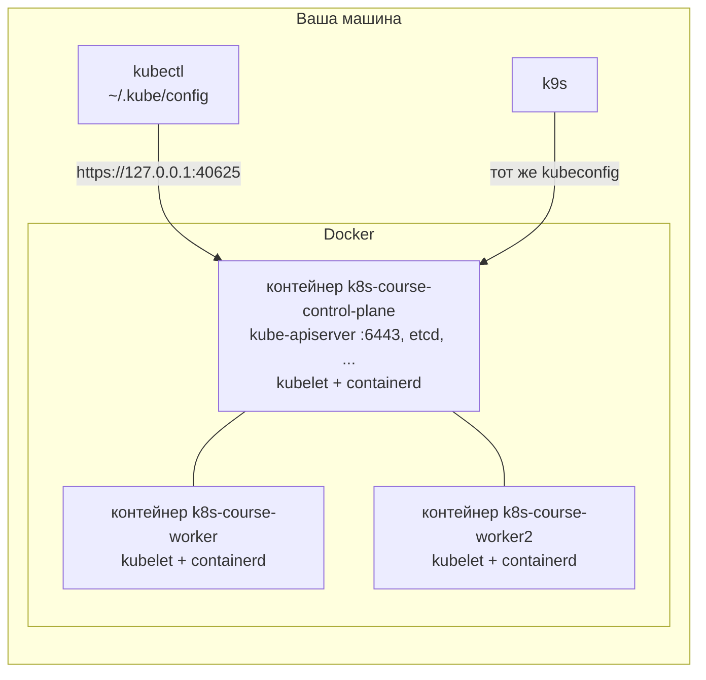
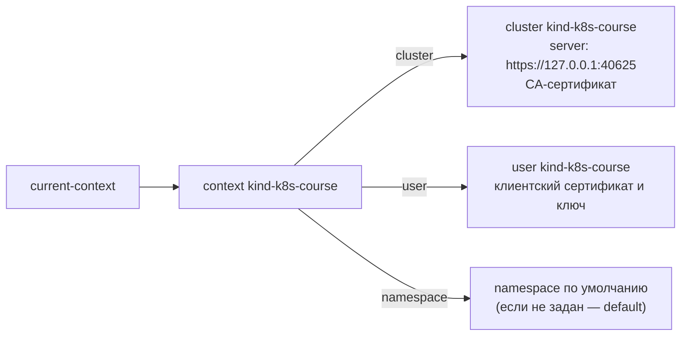

# Окружение: kind, kubectl, kubeconfig

> Модуль: `00-setup` · Тема: `01-environment` · Время: ~25 мин чтения
> Требуется: Linux-машина или VM (Ubuntu 24.04 или Debian 12/13, x86_64) с `sudo`, базовые навыки Docker

## Цели урока
После урока вы сможете:
- поднять учебный кластер из `env/`, убедиться, что он готов, и пересоздать его с нуля;
- объяснить, как устроен kind-кластер: узлы — это Docker-контейнеры, а kubectl попадает в api-server через проброшенный порт;
- прочитать kubeconfig и сказать, **куда** и **от чьего имени** уйдёт команда `kubectl`;
- создавать и переключать контексты, задавать namespace по умолчанию, подключать дополнительный kubeconfig через `KUBECONFIG`;
- по сообщению об ошибке kubectl понять, что не так в kubeconfig.

## Зачем это нужно
Kubernetes в продакшене — это десятки машин, балансировщики и облачные диски. Для обучения такое не нужно и дорого. Нужен **настоящий** кластер, который:
- поднимается за пару минут на одной машине;
- имеет несколько узлов, чтобы было видно планирование и отказ узла;
- одинаков у всех слушателей: та же версия, те же имена узлов;
- не жалко сломать: удалил и создал заново.

Для этого в курсе используется **kind** (Kubernetes IN Docker). Каждый узел кластера в kind — это Docker-контейнер, внутри которого работают kubelet и containerd. Это не эмуляция: внутри обычный Kubernetes, собранный тем же kubeadm, что и «большие» кластеры. Альтернативы (minikube, k3d, Docker Desktop) решают ту же задачу, но в курсе всё проверено только на kind, и лабы рассчитаны на него.

Второй инструмент — **kubectl**, клиент командной строки. Всё, что вы делаете с кластером, вы делаете через его API, и kubectl — самый прямой способ к нему обратиться. kubectl ничего не знает о кластере сам: адрес, сертификаты и имя пользователя он берёт из файла **kubeconfig**. Если перепутать kubeconfig или контекст в нём, команда уйдёт не в тот кластер. В учебном окружении это неудобство, в работе — авария. Поэтому kubeconfig разбираем в первом же уроке.

## Как это устроено



- **Узлы — контейнеры.** `docker ps` на вашей машине покажет ровно три контейнера: по одному на узел. Контейнеры приложений, которые вы будете запускать в Kubernetes, живут **внутри** этих контейнеров, в их собственном containerd. В `docker ps` их не видно. Как заглянуть внутрь узла, разберём в уроке 01-01.
- **api-server доступен через проброшенный порт.** Внутри контейнера control-plane kube-apiserver слушает порт `6443`. kind пробрасывает его на случайный порт хоста, только на `127.0.0.1` (у нас — `40625`, у вас будет свой). Этот адрес kind записывает в kubeconfig.
- **Остальные проброшенные порты** заданы в `env/kind-config.yaml` заранее: `8080` и `8443` на хосте понадобятся для Ingress в модуле 04, `30080` — для NodePort-сервисов.

### Установка инструментов
В чистой VM всё ставит один скрипт:
```bash
./env/vm-setup.sh
```
Что он делает (повторный запуск безопасен):

| Что | Версия | Зачем |
|---|---|---|
| Docker Engine | актуальная из get.docker.com | в нём живут узлы kind |
| kind | `v0.33.0` | создаёт и удаляет кластер; версия должна совпадать с образами узлов в `kind-config.yaml` |
| kubectl | `v1.37.1` | клиент API |
| k9s | последняя | необязательный терминальный UI |
| sysctl `fs.inotify.*` | — | без увеличенных лимитов в многоузловом kind pod падают с `too many open files` |
| `~/.bashrc` | — | автодополнение kubectl и алиас `k=kubectl` |

Скрипт добавляет вас в группу `docker`. Группы применяются только к **новой** сессии, поэтому после первого запуска нужно перелогиниться (выйти из ssh и зайти снова), иначе `docker` и `kind` будут отвечать `permission denied`.

Про версию kubectl. Kubernetes гарантирует совместимость kubectl с api-server, если их minor-версии отличаются не больше чем на одну (**version skew policy**). У нас кластер `v1.37.0`, kubectl `v1.37.1` — подходит. kubectl `v1.35` к такому кластеру уже официально не поддерживается: часть команд может работать неправильно.

### Подъём и удаление кластера
```bash
./env/up.sh     # создать кластер (если его нет), переключить kubectl на него, дождаться готовности узлов
./env/down.sh   # удалить кластер целиком
```
`up.sh` проверяет, что установлены `docker`, `kind` и `kubectl`, вызывает `kind create cluster --config kind-config.yaml` и ждёт, пока все узлы станут `Ready`. Первый запуск занимает пару минут: Docker скачивает образ узла (на диске он занимает около 1,3 ГБ).

Если кластер сломан так, что непонятно, что чинить, — пересоздайте его: `./env/down.sh && ./env/up.sh`. Каждая лаба курса работает в своём namespace и создаёт всё, что ей нужно, сама, поэтому после пересоздания кластера ничего не теряется.

## Минимальный пример
Конфигурация кластера — `env/kind-config.yaml`. Это **не** манифест Kubernetes, а конфиг для kind: его читает `kind create cluster`, а не api-server, поэтому `kubectl apply` к нему неприменим. Сокращённо:

```yaml
kind: Cluster
apiVersion: kind.x-k8s.io/v1alpha4
name: k8s-course
nodes:
  - role: control-plane
    image: kindest/node:v1.37.0@sha256:a1ed56cfb0e7b93589bdf97c8cd566405a265939e3620fc4f5de89adff580ae5
    extraPortMappings:
      - containerPort: 80
        hostPort: 8080
  - role: worker
    image: kindest/node:v1.37.0@sha256:a1ed56cfb0e7b93589bdf97c8cd566405a265939e3620fc4f5de89adff580ae5
  - role: worker
    image: kindest/node:v1.37.0@sha256:a1ed56cfb0e7b93589bdf97c8cd566405a265939e3620fc4f5de89adff580ae5
```

### Разбор полей
| Поле | Что значит | По умолчанию |
|---|---|---|
| `name` | Имя кластера. От него kind строит имена контейнеров (`k8s-course-worker`) и контекста в kubeconfig (`kind-k8s-course`) | `kind` |
| `nodes[].role` | `control-plane` или `worker`. Сколько элементов — столько узлов | один `control-plane` |
| `nodes[].image` | Образ узла. Тег задаёт версию Kubernetes, digest (`@sha256:...`) гарантирует, что у всех скачается один и тот же образ | образ, встроенный в данную версию kind |
| `nodes[].extraPortMappings` | Какие порты контейнера-узла пробросить на хост (`containerPort` → `hostPort`) | нет |
| `nodes[].labels` | Метки узла; у нас `ingress-ready: "true"` для Ingress-контроллера в модуле 04 | нет |

## kubeconfig: куда и от чьего имени
После `kind create cluster` в `~/.kube/config` появляется запись о новом кластере. Посмотреть её можно так (секреты kubectl заменяет на `DATA+OMITTED`):
```bash
kubectl config view --minify
```
```yaml
apiVersion: v1
kind: Config
clusters:
- cluster:
    certificate-authority-data: DATA+OMITTED
    server: https://127.0.0.1:40625
  name: kind-k8s-course
users:
- name: kind-k8s-course
  user:
    client-certificate-data: DATA+OMITTED
    client-key-data: DATA+OMITTED
contexts:
- context:
    cluster: kind-k8s-course
    user: kind-k8s-course
  name: kind-k8s-course
current-context: kind-k8s-course
```

kubeconfig состоит из трёх независимых списков и одного указателя:



| Поле | Что значит |
|---|---|
| `clusters[].cluster.server` | Адрес api-server. **Куда** пойдёт запрос |
| `clusters[].cluster.certificate-authority-data` | CA, которым kubectl проверяет, что говорит с настоящим api-server |
| `users[].user.client-certificate-data`, `client-key-data` | Клиентский сертификат и ключ: **кто** вы для api-server. Бывают и другие способы входа (токен, внешняя программа), подробно в уроке 07-01 |
| `contexts[].context` | Связка «кластер + пользователь + namespace по умолчанию» под одним именем. Ссылается на кластер и пользователя **по имени** |
| `current-context` | Какой контекст используется, если в команде не указан `--context` |

Namespace — «папка» для объектов внутри кластера (подробно в уроке 01-03). Если в контексте он не указан, kubectl работает в namespace `default`.

### Контексты на практике
```bash
kubectl config get-contexts                  # все контексты; текущий отмечен *
kubectl config current-context               # имя текущего
kubectl config use-context kind-k8s-course   # сделать текущим
kubectl --context kind-k8s-course get nodes  # один раз выполнить в другом контексте

# namespace по умолчанию для текущего контекста
kubectl config set-context --current --namespace=lab-00-01

# новый контекст из существующих кластера и пользователя
kubectl config set-context my-ctx --cluster=kind-k8s-course --user=kind-k8s-course --namespace=lab-00-01
kubectl config delete-context my-ctx
```
Все эти команды меняют **только файл kubeconfig** на вашей машине. В кластере от них ничего не создаётся и не меняется.

### Откуда kubectl берёт kubeconfig
По порядку приоритета:
1. флаг `--kubeconfig=путь` — ровно этот файл;
2. переменная `KUBECONFIG` — **список** файлов через `:`, которые kubectl объединяет;
3. иначе `~/.kube/config`.

При объединении по `KUBECONFIG` действуют правила:
- если элемент с одним и тем же именем (кластер, пользователь, контекст) есть в нескольких файлах, побеждает первый файл, где он встретился;
- `current-context` берётся из первого файла, где он задан;
- контекст из одного файла может ссылаться на кластер и пользователя из другого.

Последнее свойство удобно: можно держать отдельный маленький файл только с контекстами и подключать его поверх основного, не копируя сертификаты:
```bash
export KUBECONFIG=~/.kube/config:$PWD/extra-contexts.yaml
kubectl config get-contexts     # видны контексты из обоих файлов
```

## Наблюдаем в кластере

**Узлы глазами Docker:**
```bash
docker ps --format 'table {{.Names}}\t{{.Image}}\t{{.Ports}}'
```
```text
NAMES                      IMAGE                  PORTS
k8s-course-worker          kindest/node:v1.37.0
k8s-course-control-plane   kindest/node:v1.37.0   0.0.0.0:30080->30080/tcp, 0.0.0.0:8080->80/tcp, 0.0.0.0:8443->443/tcp, 127.0.0.1:40625->6443/tcp
k8s-course-worker2         kindest/node:v1.37.0
```
Последний проброс — `127.0.0.1:40625->6443/tcp` — и есть адрес api-server из kubeconfig.

**Кластеры глазами kind:**
```bash
kind get clusters
```
```text
k8s-course
```

**Текущий контекст и куда он смотрит:**
```bash
kubectl config get-contexts
```
```text
CURRENT   NAME              CLUSTER           AUTHINFO          NAMESPACE
*         kind-k8s-course   kind-k8s-course   kind-k8s-course
```
`AUTHINFO` — это пользователь. Пустой `NAMESPACE` означает `default`.

**Версии клиента и сервера:**
```bash
kubectl version
```
```text
Client Version: v1.37.1
Kustomize Version: v5.8.1
Server Version: v1.37.0
```

**Узлы глазами Kubernetes:**
```bash
kubectl get nodes -o wide
```
```text
NAME                       STATUS   ROLES           AGE   VERSION   INTERNAL-IP   ...   CONTAINER-RUNTIME
k8s-course-control-plane   Ready    control-plane   27m   v1.37.0   172.18.0.4    ...   containerd://2.3.4
k8s-course-worker          Ready    <none>          27m   v1.37.0   172.18.0.2    ...   containerd://2.3.4
k8s-course-worker2         Ready    <none>          27m   v1.37.0   172.18.0.3    ...   containerd://2.3.4
```
`INTERNAL-IP` — адреса контейнеров-узлов в Docker-сети `kind`.

### k9s
k9s — терминальный интерфейс поверх того же API и того же kubeconfig. Он не обязателен, всё в курсе делается через kubectl, но им удобно «осмотреться». Запуск — `k9s`, дальше:

| Клавиши | Действие |
|---|---|
| `:pods`, `:nodes`, `:ns`, `:ctx` + Enter | перейти к списку pod, узлов, namespace, контекстов |
| `0` | показать все namespace |
| `/текст` | фильтр по имени |
| `d` / `l` / `y` | describe / логи / YAML выбранного объекта |
| `?` | справка по клавишам |
| `Esc`, `:q` | назад, выход |

k9s показывает и позволяет удалять реальные объекты. Он работает в текущем контексте kubeconfig: прежде чем что-то удалять, посмотрите на имя контекста в шапке.

## Частые ошибки и диагностика
| Симптом | Причина | Как найти и исправить |
|---|---|---|
| `permission denied while trying to connect to the docker API at unix:///var/run/docker.sock` (от `docker` или `kind`) | Пользователь добавлен в группу `docker`, но текущая сессия открыта раньше | `id -nG` — нет `docker`? Перелогиньтесь. Для одной команды: `sg docker -c 'kind get clusters'` |
| `The connection to the server localhost:8080 was refused` | У kubectl нет kubeconfig: файла `~/.kube/config` нет, или `KUBECONFIG` указывает в пустоту. Без конфига kubectl идёт на `localhost:8080` | `kubectl config view` пустой? Восстановить запись: `kind export kubeconfig --name k8s-course` |
| Команда висит десятки секунд, затем `Get "http://localhost:8080/api..." ... connection reset by peer` | Контекст ссылается на **несуществующий кластер**, и kubectl снова идёт на `localhost:8080`. В нашем окружении на этом порту висит проброс к Ingress (порт 80 узла), поэтому вместо быстрого отказа — ожидание | `kubectl config view --minify` → `error: cannot locate cluster <имя>`: сверьте имя кластера в контексте с `kubectl config get-clusters` |
| kubectl спрашивает `Please enter Username:` | Контекст ссылается на **несуществующего пользователя** | `kubectl config view --minify` → `cannot locate user <имя>`; сверьте с `kubectl config get-users` |
| `context was not found for specified context: X` | Опечатка в `--context` или контекст из другого файла не подключён | `kubectl config get-contexts`, проверьте `echo $KUBECONFIG` |
| `No resources found in X namespace`, хотя вы точно что-то создали | Контекст смотрит в другой namespace (часто — опечатка в имени) | `kubectl config view --minify -o jsonpath='{..namespace}'`; `kubectl get ns` — есть ли вообще такой |
| `kind create cluster` падает с `address already in use` | Порт `8080`, `8443` или `30080` хоста занят другой программой | `sudo ss -ltnp \| grep -E ':(8080\|8443\|30080) '` — остановите программу или поменяйте `hostPort` |
| Pod в кластере падают с `too many open files` | Не увеличены лимиты inotify | `sysctl fs.inotify.max_user_instances` должен быть `512`; перезапустите `./env/vm-setup.sh` |
| `WARNING: version difference between client (1.3x) and server (1.37) exceeds the supported minor version skew of +/-1` | Слишком старый или новый kubectl | `kubectl version`; поставьте версию из `env/vm-setup.sh` |

Общий приём: если kubectl ведёт себя странно, первым делом выполните `kubectl config view --minify`. Эта команда не ходит в кластер и сразу показывает, **куда** и **от чьего имени** уйдёт следующий запрос.

## Шпаргалка
```bash
./env/vm-setup.sh                      # установить Docker, kind, kubectl, k9s (один раз)
./env/up.sh                            # поднять кластер
./env/down.sh                          # удалить кластер
kind get clusters                      # какие kind-кластеры есть
kind export kubeconfig --name k8s-course   # вернуть запись о кластере в ~/.kube/config
docker ps                              # узлы kind — это контейнеры
docker port k8s-course-control-plane   # проброшенные порты узла

kubectl version                        # версии клиента и сервера
kubectl cluster-info                   # адрес api-server
kubectl get nodes -o wide              # узлы и их готовность
kubectl config view --minify           # текущий контекст целиком: кластер, пользователь, namespace
kubectl config get-contexts            # все контексты
kubectl config use-context <ctx>       # переключить контекст
kubectl config set-context --current --namespace=<ns>   # namespace по умолчанию
kubectl --context <ctx> ...            # одна команда в другом контексте
export KUBECONFIG=~/.kube/config:<файл>  # подключить дополнительный kubeconfig
k9s                                    # терминальный UI
```

## Вопросы для самопроверки
1. Сколько контейнеров покажет `docker ps` при работающем учебном кластере, если в нём запущено 20 pod? Почему?
<details><summary>Ответ</summary>

Три — по одному на узел. Контейнеры pod запускает containerd **внутри** контейнеров-узлов, хостовый Docker о них не знает.
</details>

2. В kubeconfig адрес api-server — `https://127.0.0.1:40625`, а api-server слушает `6443`. Как запрос попадает по назначению?
<details><summary>Ответ</summary>

Docker пробрасывает порт `40625` хоста (только на `127.0.0.1`) на порт `6443` контейнера `k8s-course-control-plane`. Это видно в `docker ps` и `docker port k8s-course-control-plane`. Порт хоста kind выбирает случайно при создании кластера.
</details>

3. Из каких трёх частей состоит контекст и на что влияет каждая?
<details><summary>Ответ</summary>

`cluster` — куда идёт запрос (адрес api-server и его CA); `user` — с какими учётными данными; `namespace` — какой namespace подставляется, если в команде нет `-n`.
</details>

4. Вы выполнили `kubectl config set-context --current --namespace=shop`. Что изменилось в кластере?
<details><summary>Ответ</summary>

Ничего. Команды `kubectl config ...` меняют только локальный файл kubeconfig. Namespace `shop` при этом не создаётся. Если его нет, `kubectl get pods` просто ничего не найдёт.
</details>

5. `KUBECONFIG=~/.kube/config:./extra.yaml`. В `extra.yaml` есть только контекст `lab`, ссылающийся на кластер `kind-k8s-course`. Будет ли он работать? Какой контекст станет текущим?
<details><summary>Ответ</summary>

Будет: при объединении контекст из одного файла может ссылаться на кластер и пользователя из другого. Текущим останется контекст из `~/.kube/config` — `current-context` берётся из первого файла, где он задан.
</details>

6. `kubectl get pods` висит почти минуту и заканчивается ошибкой про `http://localhost:8080`. С чего начать диагностику?
<details><summary>Ответ</summary>

С `kubectl config view --minify`. Скорее всего, текущий контекст ссылается на кластер, которого нет в kubeconfig (`cannot locate cluster ...`), и kubectl пошёл на адрес по умолчанию `localhost:8080`. В нашем окружении на этом порту висит проброс к Ingress, поэтому ошибка приходит не сразу.
</details>

## Что дальше
Окружение готово. В следующем уроке (01-01) разберём, из каких компонентов состоит сам кластер, который вы только что подняли, и что происходит после `kubectl apply`.

Лабораторная работа: [lab/README.md](./lab/README.md).

## Ссылки
- [kind — Quick Start](https://kind.sigs.k8s.io/docs/user/quick-start/)
- [kind — Configuration](https://kind.sigs.k8s.io/docs/user/configuration/)
- [Install and Set Up kubectl on Linux](https://kubernetes.io/docs/tasks/tools/install-kubectl-linux/)
- [Organizing Cluster Access Using kubeconfig Files](https://kubernetes.io/docs/concepts/configuration/organize-cluster-access-kubeconfig/)
- [Configure Access to Multiple Clusters](https://kubernetes.io/docs/tasks/access-application-cluster/configure-access-multiple-clusters/)
- [Version Skew Policy](https://kubernetes.io/releases/version-skew-policy/)
- [k9s](https://k9scli.io/)
