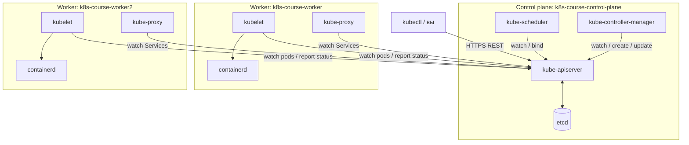
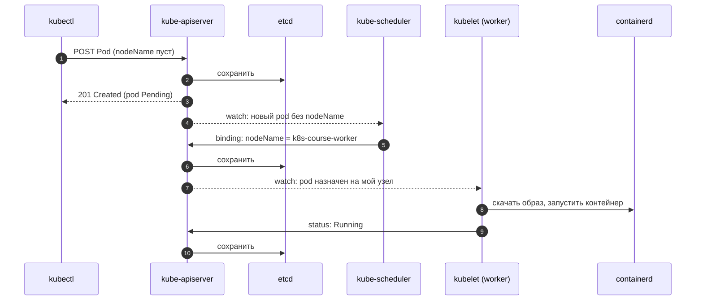
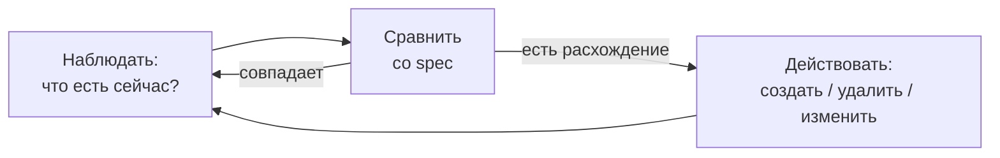

# Архитектура Kubernetes

> Модуль: `01-basics` · Тема: `01-architecture` · Время: ~30 мин чтения
> Требуется: поднятый кластер из `env/` (`./env/up.sh`), `kubectl get nodes` показывает 3 узла `Ready`

## Цели урока
После урока вы сможете:
- назвать компоненты control plane (плоскость управления) и рабочих узлов и найти каждый из них в живом кластере;
- проследить путь pod от `kubectl apply` до запущенного контейнера и сказать, какой компонент отвечает за каждый шаг;
- объяснить декларативную модель: чем `spec` отличается от `status` и что делает reconcile loop (цикл согласования);
- по симптому (`Pending` без событий, `ImagePullBackOff`) определить, какой компонент «не сделал свою работу»;
- запустить pod на конкретном узле в обход scheduler и объяснить, почему это работает.

## Зачем это нужно
Представьте, что у вас десять серверов и тридцать контейнеров. Без оркестратора вы решаете вручную:
- на какой сервер положить новый контейнер, чтобы хватило памяти;
- что делать, когда сервер ночью умер вместе с пятью контейнерами;
- как обновить версию, не уронив сервис;
- как контейнеры найдут друг друга, если их IP постоянно меняются.

Обычно это кончается набором скриптов `ssh host docker run ...`. Скрипт выполняет действие один раз: он не знает, что через час контейнер упал, а сервер перезагрузили.

Kubernetes решает это иначе. Вы не говорите ему **что сделать**, вы описываете **что должно быть**: «должно работать 3 копии `nginx:1.27-alpine`». Дальше система сама и постоянно приводит реальность к описанию. Это и есть декларативная модель, а архитектура Kubernetes — набор независимых компонентов, каждый из которых отвечает за свой кусок этой работы.

Понимать архитектуру нужно не для экзамена. Когда pod «завис», первый вопрос при отладке — **какой компонент должен был сделать следующий шаг и почему не сделал**. Без карты компонентов на этот вопрос не ответить.

## Как это устроено

Кластер состоит из двух частей:

- **Control plane** — «мозг» кластера: хранит желаемое состояние и принимает решения. В нашем kind-кластере это узел `k8s-course-control-plane`.
- **Worker nodes** (рабочие узлы) — машины, где реально работают контейнеры приложений: `k8s-course-worker` и `k8s-course-worker2`.



Главное, что видно на схеме: **все стрелки идут в kube-apiserver**. Компоненты не общаются друг с другом напрямую, только через API. Scheduler не «приказывает» kubelet, а записывает решение в объект через API; kubelet замечает это, потому что следит за API.

### Компоненты control plane

**kube-apiserver** — единственная точка входа. Через него ходят `kubectl`, все остальные компоненты и ваши приложения. На каждый запрос он:
1. проверяет, кто вы (аутентификация) и что вам можно (авторизация, подробно в уроке 07-01);
2. прогоняет объект через admission (проверки и дополнения при приёме) и валидирует схему;
3. сохраняет объект в etcd;
4. рассылает уведомления всем, кто подписан на изменения (**watch**).

kube-apiserver не хранит состояние сам и сам ничего не запускает. Это «умная обёртка» над базой данных.

**etcd** — распределённое key-value хранилище, где лежат **все** объекты кластера: pod, Deployment, Secret, узлы. Напрямую с etcd работает только kube-apiserver. В продакшене etcd обычно работает в 3 или 5 экземплярах (консенсус Raft), у нас — в одном. Потеря etcd без бэкапа — потеря кластера; бэкап разбирается в уроке 11-02.

**kube-scheduler** (планировщик) следит за pod, у которых не заполнено поле `spec.nodeName`. Для каждого такого pod он:
1. отбрасывает узлы, которые не подходят (не хватает ресурсов, запрещено правилами);
2. оценивает оставшиеся и выбирает лучший;
3. записывает выбранный узел в pod (операция *binding*).

Всё. Scheduler не запускает контейнеры, а только заполняет одно поле. Если у pod `nodeName` уже заполнен, scheduler его не трогает. А обрабатывает он только pod, у которых `spec.schedulerName` совпадает с его именем (`default-scheduler`).

**kube-controller-manager** — один процесс, внутри которого работают десятки **контроллеров**: ReplicaSet controller, Deployment controller, Node controller, Job controller и другие. Каждый следит за своим типом объектов и доводит реальность до описания. Например, ReplicaSet controller видит «нужно 3 pod, есть 2» и создаёт ещё один.

**cloud-controller-manager** есть только в облаках: создаёт балансировщики, подключает диски. В kind его нет; локальная замена появится в модуле 04.

### Компоненты рабочего узла

**kubelet** — агент на каждом узле (включая control-plane). Он работает **не в pod**, а обычным системным сервисом (systemd). kubelet:
- следит через API за pod, назначенными на **его** узел (`spec.nodeName` = имя узла);
- через CRI (Container Runtime Interface) просит container runtime скачать образ и запустить контейнеры;
- пишет в `status` pod, что происходит: `Running`, `ImagePullBackOff`, перезапуски;
- регулярно продлевает свой **Lease** (объект-«пульс» в namespace `kube-node-lease`), чтобы control plane знал, что узел жив.

**Container runtime** (среда выполнения контейнеров) — в нашем кластере **containerd**. Скачивает образы и запускает контейнеры. Docker на узлах Kubernetes не нужен: kubelet общается с runtime через CRI.

**kube-proxy** реализует Services (сервисы, урок 04-01): следит за ними и настраивает на узле правила iptables (у нас режим `iptables`), чтобы трафик на виртуальный IP сервиса попадал в нужные pod.

### Дополнения (addons)
Ещё несколько вещей обязательны для рабочего кластера, но формально в «ядро» не входят:
- **CNI-плагин** выдаёт pod IP-адреса и связывает узлы сетью. В kind это `kindnet`.
- **CoreDNS** — DNS внутри кластера (урок 04-02).
- **local-path-provisioner** выдаёт тома для хранилища (модуль 05).

### Как control plane запускается сам? Static pods
Если pod запускает kubelet, а pod назначает scheduler, то кто запускает сам scheduler? Ответ — **static pods** (статические pod). kubelet на control-plane узле читает YAML-файлы из каталога `/etc/kubernetes/manifests` и запускает их **сам**, без api-server и scheduler. Так стартуют etcd, kube-apiserver, kube-scheduler и kube-controller-manager. Чтобы их было видно в `kubectl get pods`, kubelet создаёт в API **mirror pod** (зеркальную копию). Удалить mirror pod через `kubectl` нельзя: kubelet создаст его снова. Остановить компонент можно, только убрав файл из каталога.

### Путь pod: от `kubectl apply` до контейнера



Обратите внимание на шаг 3: `kubectl apply` возвращает успех **сразу**, как только объект записан в etcd. Контейнер к этому моменту ещё не существует. «Объект создан» и «приложение работает» — разные вещи, и в этом разрыве живёт большинство проблем.

## Декларативная модель и reconcile loop

У почти каждого объекта есть две половины:
- **`spec`** — желаемое состояние. Пишете вы (или другой контроллер).
- **`status`** — наблюдаемое состояние. Пишет система: kubelet, контроллеры.

Каждый контроллер крутит один и тот же цикл:



Важное свойство: контроллер реагирует на **текущее состояние**, а не на историю событий. Если он перезапустился и пропустил десять уведомлений, ничего страшного: он посмотрит на состояние сейчас и доведёт его до нужного. Поэтому Kubernetes «самовосстанавливается»: удалённый pod Deployment вернётся, упавший контейнер kubelet перезапустит.

Обратная сторона: `status` честен ровно настолько, насколько жив тот, кто его пишет. Если контроллер остановлен, `status` объекта застывает и показывает устаревшую картину. Это мы увидим в эксперименте ниже.

## Минимальный пример
Самый маленький объект, который проходит весь путь «apiserver → scheduler → kubelet», — Pod. Подробно pod разбирается в уроке 02-01; здесь он нужен как «подопытный».

```yaml
# apply: kubectl apply -f pod.yaml -n lab-01-01
apiVersion: v1
kind: Pod
metadata:
  name: hello
spec:
  containers:
    - name: web
      image: nginx:1.27-alpine
```

### Разбор полей
| Поле | Что значит | По умолчанию |
|---|---|---|
| `apiVersion` | Группа и версия API, к которой относится тип. Pod — в «core»-группе, поэтому просто `v1` | — (обязательно) |
| `kind` | Тип объекта | — (обязательно) |
| `metadata.name` | Имя, уникальное в пределах namespace | — (обязательно) |
| `spec.containers[].image` | Образ, который kubelet попросит скачать containerd | — (обязательно) |
| `spec.nodeName` | На каком узле запустить. Обычно пусто, заполняет scheduler | пусто |
| `spec.schedulerName` | Какой планировщик должен обработать pod | `default-scheduler` |

Структуру `apiVersion/kind/metadata/spec/status` подробно разберём в следующем уроке (01-02).

## Наблюдаем в кластере

**Узлы и роли:**
```bash
kubectl get nodes -o wide
```
```text
NAME                       STATUS   ROLES           AGE   VERSION   INTERNAL-IP   ...   CONTAINER-RUNTIME
k8s-course-control-plane   Ready    control-plane   1h    v1.37.0   172.18.0.4    ...   containerd://2.3.4
k8s-course-worker          Ready    <none>          1h    v1.37.0   172.18.0.2    ...   containerd://2.3.4
k8s-course-worker2         Ready    <none>          1h    v1.37.0   172.18.0.3    ...   containerd://2.3.4
```

**Куда ходит kubectl** — адрес kube-apiserver (порт в kind случайный):
```bash
kubectl cluster-info
```
```text
Kubernetes control plane is running at https://127.0.0.1:40625
```

**Компоненты control plane и узлов** живут в namespace `kube-system` (namespace — «папка» для объектов, подробно в уроке 01-03):
```bash
kubectl get pods -n kube-system -o wide
```
```text
NAME                                               READY   STATUS    NODE
etcd-k8s-course-control-plane                      1/1     Running   k8s-course-control-plane
kube-apiserver-k8s-course-control-plane            1/1     Running   k8s-course-control-plane
kube-controller-manager-k8s-course-control-plane   1/1     Running   k8s-course-control-plane
kube-scheduler-k8s-course-control-plane            1/1     Running   k8s-course-control-plane
kube-proxy-7ff4d                                   1/1     Running   k8s-course-control-plane
kube-proxy-hzv7q                                   1/1     Running   k8s-course-worker2
kube-proxy-sjb79                                   1/1     Running   k8s-course-worker
kindnet-...                                        1/1     Running   (по одному на узел)
coredns-...                                        1/1     Running   ...
```
(Колонки сокращены.) Static pods узнаются по суффиксу с именем узла (`-k8s-course-control-plane`). kube-proxy и kindnet работают по одному на каждом узле. kubelet в этом списке **нет**: он не pod.

**Здоровье api-server:**
```bash
kubectl get --raw='/readyz?verbose' | tail -3
```
```text
[+]shutdown ok
readyz check passed
```

**Заглянуть внутрь узла.** Узлы kind — это Docker-контейнеры, поэтому в них можно зайти через `docker exec`:
```bash
docker exec k8s-course-control-plane ls /etc/kubernetes/manifests
# etcd.yaml  kube-apiserver.yaml  kube-controller-manager.yaml  kube-scheduler.yaml

docker exec k8s-course-worker systemctl is-active kubelet
# active

docker exec k8s-course-worker crictl ps     # контейнеры глазами containerd
```
> Если `docker` отвечает `permission denied`, ваш пользователь ещё не в группе `docker` для текущей сессии: перелогиньтесь.

**Кто что сделал — events (события).** Создайте pod из примера и посмотрите его события:
```bash
kubectl create namespace lab-01-01
kubectl apply -f pod.yaml -n lab-01-01
kubectl describe pod hello -n lab-01-01 | sed -n '/^Events/,$p'
```
```text
Events:
  Type    Reason     From               Message
  ----    ------     ----               -------
  Normal  Scheduled  default-scheduler  Successfully assigned lab-01-01/hello to k8s-course-worker
  Normal  Pulling    kubelet            spec.containers{web}: Pulling image "nginx:1.27-alpine"
  Normal  Pulled     kubelet            spec.containers{web}: Successfully pulled image "nginx:1.27-alpine" in 13.1s
  Normal  Created    kubelet            spec.containers{web}: Container created
  Normal  Started    kubelet            spec.containers{web}: Container started
```
(Колонку `Age` мы опустили. Если образ уже есть на узле, вместо `Pulling`/`Successfully pulled` будет `Container image ... already present on machine`.)
Колонка `From` — это ровно наша диаграмма: сначала `default-scheduler` выбрал узел, потом `kubelet` этого узла скачал образ и запустил контейнер.

### Эксперимент: выключаем controller-manager
Здесь мы увидим reconcile loop в действии и что бывает без него. Для эксперимента нужен Deployment (объект «держи N копий pod», урок 02-03); создадим его одной командой:

```bash
kubectl -n lab-01-01 create deployment demo --image=nginx:1.27-alpine --replicas=3
kubectl -n lab-01-01 rollout status deployment/demo
```

1. Удалите один pod и сразу посмотрите список: через пару секунд вместо него появится новый с другим именем. Это ReplicaSet controller увидел «нужно 3, есть 2».
   ```bash
   kubectl -n lab-01-01 delete pod $(kubectl -n lab-01-01 get pod -l app=demo -o name | head -1 | cut -d/ -f2)
   kubectl -n lab-01-01 get pods -l app=demo
   ```
2. Остановите controller-manager, убрав его static pod manifest:
   ```bash
   docker exec k8s-course-control-plane mv /etc/kubernetes/manifests/kube-controller-manager.yaml /etc/kubernetes/
   ```
3. Удалите ещё один pod. Новый **не появится**. А теперь посмотрите на Deployment:
   ```bash
   kubectl -n lab-01-01 get deployment demo
   ```
   ```text
   NAME   READY   UP-TO-DATE   AVAILABLE   AGE
   demo   3/3     3            3           2m
   ```
   pod два, а `status` говорит `3/3`: его некому обновить.
4. **Обязательно** верните controller-manager на место:
   ```bash
   docker exec k8s-course-control-plane mv /etc/kubernetes/kube-controller-manager.yaml /etc/kubernetes/manifests/
   kubectl -n kube-system wait --for=condition=Ready pod -l component=kube-controller-manager --timeout=120s
   kubectl -n lab-01-01 get pods -l app=demo     # снова 3
   ```
   Контроллер стартовал, посмотрел на текущее состояние и восстановил третий pod. Ему не нужна «история», что произошло, пока его не было.

Уберите за собой: `kubectl delete namespace lab-01-01` (лаба создаст его заново).

## Частые ошибки и диагностика
| Симптом | Причина | Как найти |
|---|---|---|
| `kubectl` пишет `connection refused` / идёт на `localhost:8080` | Нет kubeconfig или выбран не тот контекст: kubectl не знает адрес api-server | `kubectl config current-context`, `kubectl config get-contexts` |
| Pod в `Pending`, `Node: <none>`, в Events `FailedScheduling` | Scheduler работает, но не нашёл подходящий узел | `kubectl describe pod` — в сообщении причина по каждому узлу |
| Pod в `Pending`, `Node: <none>`, Events `<none>` | Никто не взялся планировать: `schedulerName` указывает на несуществующий планировщик, либо сам scheduler не работает | `kubectl get pod X -o jsonpath='{.spec.schedulerName}'`, `kubectl -n kube-system get pods -l component=kube-scheduler` |
| Pod назначен на узел (`Node:` заполнен), статус `ErrImagePull` / `ImagePullBackOff` | Scheduler отработал, kubelet не смог скачать образ: опечатка в имени или теге, приватный реестр | Events от `kubelet`: `Failed to pull image ...: not found` |
| Удалённые pod Deployment не возвращаются, `status` не меняется | Не работает kube-controller-manager | `kubectl -n kube-system get pods -l component=kube-controller-manager` |
| `kubectl apply` для pod падает с `Forbidden: pod updates may not change fields other than ...` | Большинство полей `spec` у pod неизменяемы (можно менять, например, `image`) | Удалите pod и создайте заново: `kubectl delete -f ...; kubectl apply -f ...` |
| Узел `NotReady` | kubelet на узле остановлен или не может продлить Lease | `kubectl describe node X` (раздел Conditions), `docker exec X systemctl status kubelet` |

Общий приём: посмотрите, **какой последний шаг состоялся** (`Node:` заполнен? есть события от kubelet?). Сбой — в компоненте, который отвечает за следующий шаг.

## Шпаргалка
```bash
kubectl cluster-info                                   # адрес api-server
kubectl get nodes -o wide                              # узлы, версии, runtime
kubectl get pods -n kube-system -o wide                # компоненты кластера и где они
kubectl get pods -n kube-system -l tier=control-plane  # только static pods control plane
kubectl get --raw='/readyz?verbose'                    # здоровье api-server
kubectl get lease -n kube-node-lease                   # «пульс» узлов
kubectl describe pod <pod>                             # Node:, Events: кто что сделал
kubectl get events -n <ns> --sort-by=.lastTimestamp    # события namespace по времени
docker exec k8s-course-control-plane ls /etc/kubernetes/manifests   # static pods
docker exec <узел> crictl ps                           # контейнеры глазами runtime
```

## Вопросы для самопроверки
1. С каким компонентом напрямую работает etcd?
<details><summary>Ответ</summary>

Только с kube-apiserver. Все остальные компоненты, включая scheduler и kubelet, читают и пишут объекты через API.
</details>

2. `kubectl apply -f pod.yaml` вернул `pod/hello created`. Значит ли это, что контейнер запущен?
<details><summary>Ответ</summary>

Нет. Это значит только, что api-server принял объект и сохранил его в etcd. Дальше scheduler должен назначить узел, а kubelet — скачать образ и запустить контейнер. Проверять нужно `status` (`kubectl get pod`, `kubectl describe pod`).
</details>

3. Что именно меняет в pod kube-scheduler?
<details><summary>Ответ</summary>

Одно поле — `spec.nodeName` (через binding). Контейнеры он не запускает. Если `nodeName` заполнен заранее, scheduler pod не трогает.
</details>

4. Pod висит в `Pending`, `Node: <none>`, событий нет совсем. Какой компонент не сделал свою работу и что проверить?
<details><summary>Ответ</summary>

Планировщик: pod никто не взялся планировать. Проверить `spec.schedulerName` (вдруг там имя несуществующего планировщика) и жив ли `kube-scheduler` в `kube-system`. Если бы scheduler пытался и не смог, было бы событие `FailedScheduling`.
</details>

5. Почему kubelet не виден в `kubectl get pods -n kube-system`, а kube-apiserver виден?
<details><summary>Ответ</summary>

kubelet — системный сервис узла (systemd), он запускает pod, а сам pod не является. kube-apiserver — static pod: kubelet запускает его из файла в `/etc/kubernetes/manifests` и публикует в API mirror pod.
</details>

6. Пока controller-manager был выключен, Deployment показывал `3/3`, хотя pod было два. Почему?
<details><summary>Ответ</summary>

`status` пишут контроллеры. Остановленный контроллер его не обновляет, и `status` застывает в последнем известном значении. `spec` — желание, `status` — отчёт, и отчёт верен, только пока жив тот, кто его пишет.
</details>

7. Почему после возврата controller-manager недостающий pod восстановился, хотя контроллер «пропустил» момент удаления?
<details><summary>Ответ</summary>

Reconcile loop сравнивает **текущее** состояние с желаемым, а не обрабатывает историю событий. При старте контроллер увидел «нужно 3, есть 2» и создал один pod.
</details>

## Что дальше
В следующем уроке (01-02) разберём сам API: из чего состоит любой объект, как читать его структуру через `kubectl explain` и как работать с `kubectl` эффективно.

Лабораторная работа: [lab/README.md](./lab/README.md).

## Ссылки
- [Cluster Architecture](https://kubernetes.io/docs/concepts/architecture/)
- [Kubernetes Components](https://kubernetes.io/docs/concepts/overview/components/)
- [Controllers](https://kubernetes.io/docs/concepts/architecture/controller/)
- [Kubernetes Scheduler](https://kubernetes.io/docs/concepts/scheduling-eviction/kube-scheduler/)
- [Static Pods](https://kubernetes.io/docs/tasks/configure-pod-container/static-pod/)
- [Node heartbeats / Leases](https://kubernetes.io/docs/concepts/architecture/leases/)
