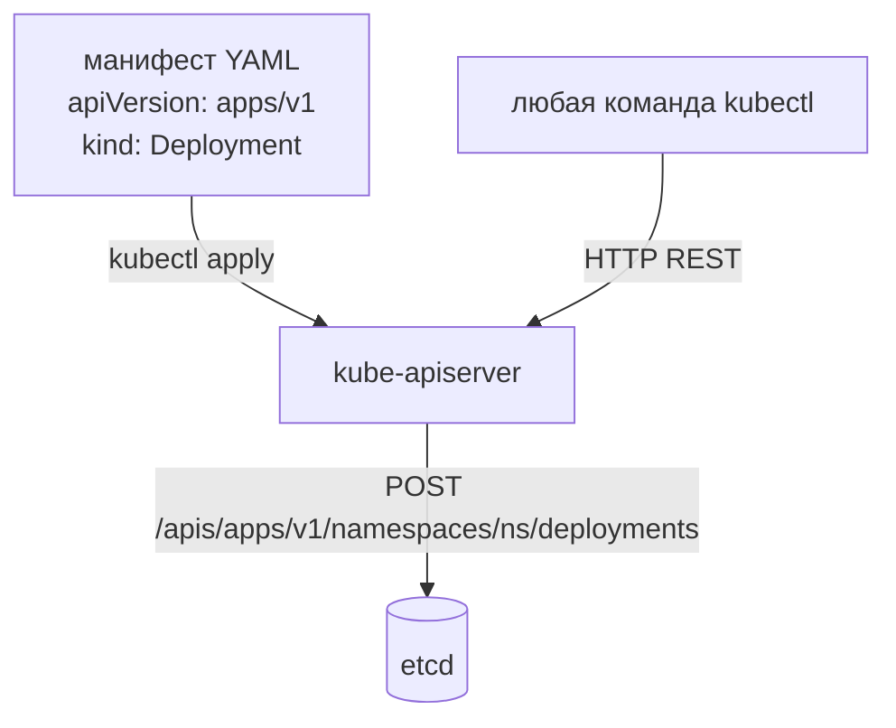

# API и kubectl

> Модуль: `01-basics` · Тема: `02-api-and-kubectl` · Время: ~30 мин чтения
> Требуется: урок 01-01 (архитектура), поднятый кластер из `env/`

## Цели урока
После урока вы сможете:
- назвать части любого объекта (`apiVersion`, `kind`, `metadata`, `spec`, `status`) и находить их у реальных ресурсов;
- по имени ресурса определить его API-группу и версию через `kubectl api-resources` и строить полное имя (`deployments.apps`);
- читать схему полей через `kubectl explain`, в том числе обязательные и значения по умолчанию;
- доставать из объектов ровно нужные данные через `-o jsonpath` и `-o custom-columns`;
- проверять манифест до применения через `--dry-run=server` и `kubectl diff`;
- получить первый доступ к приложению через `kubectl port-forward`, `exec` и `logs` и понимать, что каждая команда `kubectl` — это HTTP-запрос к api-server.

## Зачем это нужно
В уроке 01-01 вы видели: всё в кластере проходит через kube-apiserver, а состояние описывается объектами. `kubectl` — это просто удобный HTTP-клиент к этому API. Любая команда — `get`, `apply`, `logs` — превращается в REST-запрос и уходит на api-server; тот же запрос мог бы сделать `curl`.

Отсюda практический вывод: если вы понимаете структуру объекта и умеете спросить у кластера «какие бывают поля» и «что сейчас в этом поле», вам не нужно заучивать манифесты наизусть. Вы выводите их из самого кластера. Это и есть профессиональный способ работы: не копировать YAML со StackOverflow, а читать `explain` и `api-resources`.

Для инженера по безопасности есть ещё один угол: раз каждая команда — это запрос к API, то все действия в кластере в принципе наблюдаемы. На этом строится аудит (подробно в уроке 08-01). Привыкайте думать «какой HTTP-запрос стоит за этой командой» — это пригодится и при отладке, и при разборе инцидентов.

## Как это устроено

### Объект = `apiVersion` + `kind` + `metadata` + `spec` + `status`
Любой объект Kubernetes устроен одинаково:

```yaml
apiVersion: v1          # группа и версия API, которой принадлежит тип
kind: Pod               # тип объекта
metadata:               # идентификация: имя, namespace, labels, annotations
  name: web
spec:                   # желаемое состояние — что должно быть (пишете вы)
  containers:
    - name: web
      image: nginx:1.27-alpine
status:                 # наблюдаемое состояние — что есть (пишет система)
  phase: Running
```

`spec` против `status` мы разбирали в 01-01: `spec` — желание, `status` — отчёт. В манифесте вы пишете только `apiVersion`, `kind`, `metadata` и `spec`; `status` заполняет кластер, и в файл его класть не нужно.

### API-группы и версии
`apiVersion` состоит из **группы** и **версии**. Исторически первые объекты (Pod, Service, ConfigMap, Node, Namespace) лежат в «core»-группе без имени — у них `apiVersion: v1`. Остальные сгруппированы по смыслу: `apps/v1` (Deployment, ReplicaSet, DaemonSet, StatefulSet), `batch/v1` (Job, CronJob), `networking.k8s.io/v1` (Ingress, NetworkPolicy) и так далее.

Полное имя ресурса — это `<множественное>.<группа>`: `deployments.apps`, `cronjobs.batch`. Короткое имя (`deployments`) работает, пока оно однозначно. Это важно, когда один и тот же `kind` есть в разных группах: например, `Event` есть и в `v1`, и в `events.k8s.io/v1`.



Путь в REST собирается ровно из этих частей: core-группа обслуживается под `/api/v1/...`, именованные группы — под `/apis/<группа>/<версия>/...`.

### `kubectl api-resources` — что вообще есть
Команда перечисляет все типы, которые понимает ваш кластер (включая установленные через CRD, урок 11-01):

```bash
kubectl api-resources
```
```text
NAME          SHORTNAMES   APIVERSION   NAMESPACED   KIND
configmaps    cm           v1           true         ConfigMap
nodes         no           v1           false        Node
pods          po           v1           true         Pod
services      svc          v1           true         Service
deployments   deploy       apps/v1      true         Deployment
cronjobs      cj           batch/v1     true         CronJob
```
Колонки отвечают на частые вопросы: `SHORTNAMES` — сокращения (`kubectl get po`), `APIVERSION` — куда класть в манифесте, `NAMESPACED` — живёт объект в namespace или глобально (узлы — глобально), `KIND` — как писать в поле `kind`.

### `kubectl explain` — схема полей
`explain` показывает документацию и тип любого поля, прямо из схемы вашего кластера, а не из интернета. Это главный инструмент против «а какое там поле»:

```bash
kubectl explain pod.spec.containers
kubectl explain deployment.spec.replicas
```
```text
GROUP:      apps
KIND:       Deployment
FIELD: replicas <integer>
DESCRIPTION:
    Number of desired pods. ... Defaults to 1.
```
Полезные варианты: `kubectl explain pod.spec --recursive` выведет всё дерево полей сразу; у поля-перечисления (например `pod.spec.restartPolicy`) `explain` показывает допустимые значения.

## Наблюдаем объект в кластере
Создадим pod (Pod — минимальная единица запуска, подробно в уроке 02-02; здесь он снова «подопытный»):

```yaml
# apply: kubectl apply -f pod.yaml -n lab-01-02
apiVersion: v1
kind: Pod
metadata:
  name: web
  labels:
    app: web
spec:
  containers:
    - name: web
      image: nginx:1.27-alpine
      ports:
        - containerPort: 80
```

**Полный объект с заполненным `status`** (система дописала десятки полей по умолчанию):
```bash
kubectl get pod web -n lab-01-02 -o yaml
```
Обратите внимание: в выводе появились `status.phase`, `status.podIP`, `spec.nodeName`, `spec.serviceAccountName: default`, `imagePullPolicy: IfNotPresent` и прочее, чего вы не писали. Это нормально: часть полей проставляет admission, часть — контроллеры и kubelet.

### Достаём только нужное: jsonpath и custom-columns
Полный YAML читать глазами долго. Чтобы достать конкретные значения — `-o jsonpath`:
```bash
kubectl get pod web -n lab-01-02 -o jsonpath='{.spec.nodeName}'
kubectl get pod web -n lab-01-02 -o jsonpath='{.status.podIP}'
```
Перебор списка и форматирование:
```bash
kubectl get nodes -o jsonpath='{range .items[*]}{.metadata.name}{"\t"}{.status.nodeInfo.kubeletVersion}{"\n"}{end}'
```
Табличная выборка — `-o custom-columns`:
```bash
kubectl get pods -A -o custom-columns=NS:.metadata.namespace,NAME:.metadata.name,NODE:.spec.nodeName
```
`-o name` печатает ссылки на объекты (`pod/web`) — удобно скармливать в скрипты.

### `describe` — человекочитаемый разбор
`kubectl describe` не ходит в один объект, а собирает по нему всё важное, включая **events** (события), привязанные к объекту:
```bash
kubectl describe pod web -n lab-01-02
```
В отличие от `get -o yaml`, `describe` показывает события и агрегирует связанные объекты — это первый инструмент при отладке.

## Создание и изменение объектов

### Императивно и декларативно
- **Императивно** — командой: `kubectl run`, `kubectl create`, `kubectl expose`, `kubectl scale`. Быстро, но нет истории в файле.
- **Декларативно** — `kubectl apply -f`: вы описываете желаемое в файле, kubectl приводит кластер к нему. Повторный `apply` того же файла ничего не ломает (идемпотентность).

Профессиональный приём — сгенерировать заготовку императивной командой с `--dry-run=client -o yaml`, сохранить в файл и дальше вести декларативно:
```bash
kubectl run web --image=nginx:1.27-alpine --dry-run=client -o yaml > pod.yaml
```
`--dry-run=client` означает «не отправляй на сервер, просто покажи, что получилось бы».

### Два вида dry-run
- `--dry-run=client` — kubectl формирует объект локально и печатает его. Сервер не участвует, поэтому ошибок схемы и admission он не поймает.
- `--dry-run=server` — объект **уходит на api-server**, проходит валидацию и admission, но не сохраняется в etcd. Это настоящая проверка «а примется ли манифест»:
```bash
kubectl apply -f pod.yaml -n lab-01-02 --dry-run=server
```

### `kubectl diff` — что именно изменится
Перед применением правок посмотрите разницу с тем, что уже в кластере:
```bash
kubectl diff -f pod.yaml -n lab-01-02
```
Выводит построчный дифф между вашим файлом и текущим объектом; удобно, чтобы не применить лишнего.

## Первый доступ к приложению
Пока у вас нет Service (урок 02-05), достучаться до pod можно тремя способами — все через api-server:

```bash
# пробросить локальный порт на порт pod
kubectl port-forward pod/web -n lab-01-02 8080:80
#   в другом терминале: curl http://localhost:8080

# выполнить команду внутри контейнера
kubectl exec -it pod/web -n lab-01-02 -- sh

# логи контейнера
kubectl logs pod/web -n lab-01-02
```
Все три работают **через kube-apiserver**: он проксирует соединение к kubelet нужного узла. Поэтому они не требуют сетевого доступа к самому pod и подчиняются правам (RBAC, урок 07-02).

### Команда kubectl — это запрос к API
Чтобы увидеть сам HTTP-запрос, повысьте уровень логирования флагом `-v`:
```bash
kubectl get pod web -n lab-01-02 -v=6
```
```text
GET https://127.0.0.1:40625/api/v1/namespaces/lab-01-02/pods/web 200 OK
```
Тот же объект можно запросить напрямую, в обход удобных команд:
```bash
kubectl get --raw /api/v1/namespaces/lab-01-02/pods/web | head -c 200
```
Это и есть «мостик к аудиту»: каждое ваше действие — такой запрос, и его видно в аудит-логе (урок 08-01).

## Частые ошибки и диагностика
| Симптом | Причина | Как найти |
|---|---|---|
| `error: unable to recognize ...: no matches for kind "Deployment" in version "apps/v1beta2"` | Удалённая/неверная версия API в `apiVersion` | `kubectl api-resources \| grep -i deployment` — там актуальный `APIVERSION` |
| `strict decoding error: unknown field "spec.replica"` | Опечатка в имени поля; сервер строго отвергает незнакомые поля | `kubectl explain deployment.spec` — проверьте точное имя |
| `cannot unmarshal string into ... of type int32` | Число записано строкой (`containerPort: "80"`) | уберите кавычки; тип поля виден в `kubectl explain` |
| `the server doesn't have a resource type "pood"` | Опечатка в имени ресурса | `kubectl api-resources`, проверьте имя и SHORTNAMES |
| `error validating data: ... missing required field` | Не заполнено обязательное поле | `kubectl explain <путь>` — обязательные помечены `-required-` |
| `Error from server (NotFound)` | Объект есть в другом namespace или не создан | добавьте `-n <ns>` или `-A`; `kubectl get ns` |

Общий приём: сначала `--dry-run=server`. Он отдаёт ту же ошибку, что и реальное применение, но ничего не создаёт — быстрый цикл «поправил → проверил».

## Шпаргалка
```bash
kubectl api-resources                           # все типы: имя, группа, short, namespaced
kubectl api-versions                             # все группы/версии
kubectl explain <kind>.<path>                    # схема поля (--recursive — всё дерево)
kubectl get <res> <name> -o yaml                 # полный объект вместе со status
kubectl get <res> -o jsonpath='{...}'            # достать конкретные поля
kubectl get <res> -o custom-columns=COL:.path    # таблица по своим колонкам
kubectl describe <res> <name>                    # разбор + events
kubectl run web --image=... --dry-run=client -o yaml > pod.yaml   # заготовка манифеста
kubectl apply -f f.yaml --dry-run=server         # проверка на сервере без записи
kubectl diff -f f.yaml                            # что изменится
kubectl port-forward pod/web 8080:80             # локальный доступ к pod
kubectl exec -it pod/web -- sh                   # шелл в контейнере
kubectl logs pod/web                              # логи
kubectl get --raw /api/v1/namespaces/<ns>/pods/<name>   # прямой запрос к API
kubectl get pod web -v=6                          # показать HTTP-запрос
```

## Вопросы для самопроверки
1. У объекта `apiVersion: apps/v1`, `kind: Deployment`. Какая это группа и как выглядит полное имя ресурса?
<details><summary>Ответ</summary>

Группа `apps`, версия `v1`. Полное имя — `deployments.apps`. Core-объекты (Pod, Service) были бы с `apiVersion: v1` и жили бы под `/api/v1/...`, а `apps` — под `/apis/apps/v1/...`.
</details>

2. Вы написали в манифесте только `apiVersion/kind/metadata/spec`, а `kubectl get -o yaml` показывает ещё и `status`, и кучу полей в `spec`, которых вы не писали. Откуда они?
<details><summary>Ответ</summary>

`status` пишет система (контроллеры, kubelet). Недостающие поля `spec` — это значения по умолчанию, проставленные admission/api-server (например `imagePullPolicy`, `serviceAccountName: default`). В файл их класть не нужно.
</details>

3. Чем `--dry-run=client` отличается от `--dry-run=server`?
<details><summary>Ответ</summary>

`client` формирует объект локально и не ходит на сервер — не поймает ошибок схемы и admission. `server` отправляет объект на api-server, он проходит валидацию и admission, но не сохраняется в etcd. Для проверки «примется ли» нужен `server`.
</details>

4. Нужно быстро узнать, на каком узле работает pod `web`, не читая весь YAML. Как?
<details><summary>Ответ</summary>

`kubectl get pod web -o jsonpath='{.spec.nodeName}'` (или `-o wide`, колонка NODE). Узел проставляет scheduler в `spec.nodeName`.
</details>

5. `kubectl apply` ругается `unknown field "spec.replica"`. Что это и как найти правильное имя?
<details><summary>Ответ</summary>

Опечатка в имени поля (`replica` вместо `replicas`); api-server строго отвергает незнакомые поля. Точное имя — `kubectl explain deployment.spec`.
</details>

6. Почему `kubectl port-forward` и `kubectl exec` работают, даже если у вас нет прямого сетевого доступа к pod?
<details><summary>Ответ</summary>

Они идут через kube-apiserver, который проксирует соединение к kubelet нужного узла. Поэтому они подчиняются аутентификации и RBAC и видны в аудите, как любой запрос к API.
</details>

## Что дальше
В следующем уроке (01-03) разберём namespaces как границу и labels/selectors — как группировать и выбирать объекты, которыми вы теперь умеете управлять.

Лабораторная работа: [lab/README.md](./lab/README.md).

## Ссылки
- [Kubernetes API Concepts](https://kubernetes.io/docs/reference/using-api/api-concepts/)
- [Objects In Kubernetes](https://kubernetes.io/docs/concepts/overview/working-with-objects/)
- [kubectl Cheat Sheet](https://kubernetes.io/docs/reference/kubectl/cheatsheet/)
- [JSONPath Support](https://kubernetes.io/docs/reference/kubectl/jsonpath/)
- [Server-Side Dry Run](https://kubernetes.io/docs/reference/using-api/api-concepts/#dry-run)
