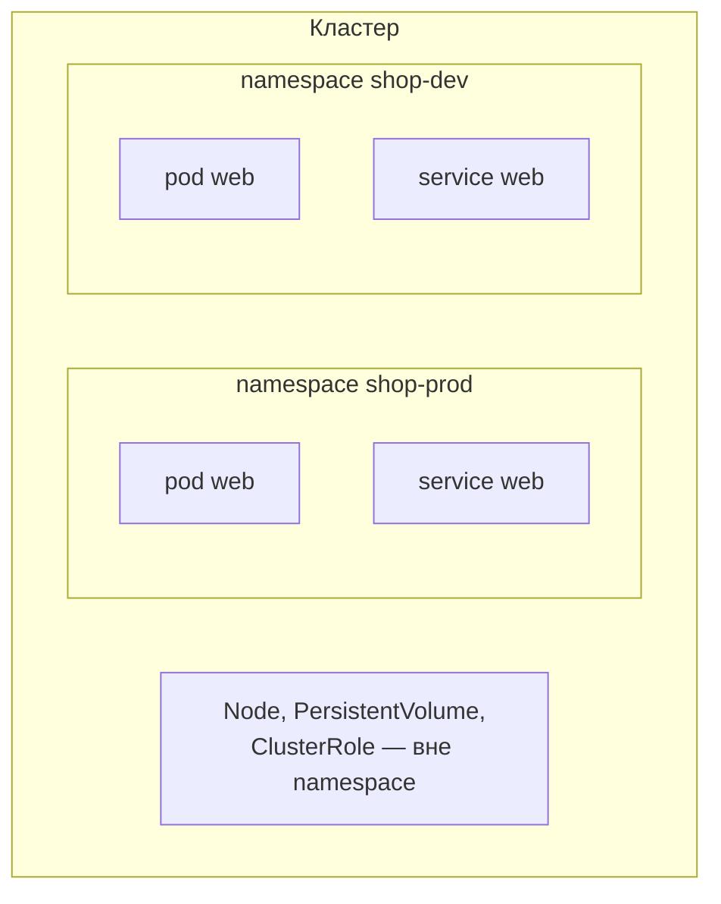
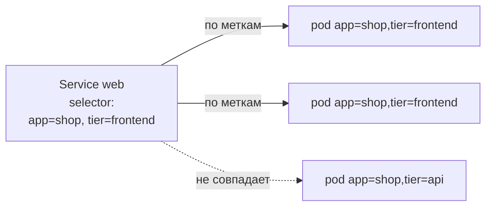

# Namespaces, labels, annotations

> Модуль: `01-basics` · Тема: `03-namespaces-labels` · Время: ~25 мин чтения
> Требуется: уроки 01-01 (архитектура) и 01-02 (API и kubectl)

## Цели урока
После урока вы сможете:
- объяснить, что namespace (пространство имён) — это граница именования и область действия, но **не** граница безопасности сама по себе;
- создавать namespace и работать в нём, понимая, какие объекты namespaced, а какие глобальные;
- навешивать labels (метки) и выбирать объекты по ним через equality- и set-селекторы;
- объяснить, как через selector один объект находит другие (Service → pod, Deployment → pod) — на этом стоит половина Kubernetes;
- отличать labels от annotations (аннотаций) и понимать, что для чего.

## Зачем это нужно
В одном кластере живут десятки команд, сред и приложений. Без разбиения вы быстро получите конфликт имён (`service web` у двух команд) и кашу в `kubectl get`. Нужен способ **разделить** объекты и способ **выбирать** их группами.

Kubernetes даёт два ортогональных механизма:
- **namespaces** режут кластер на именованные области. Имя объекта уникально внутри namespace, а не во всём кластере. Это «папки».
- **labels** — произвольные пары «ключ=значение» на объектах. По ним объекты выбираются **поперёк** иерархии: «все pod с `app=shop` в проде». Это «теги».

Селекторы по меткам — не просто для `kubectl get`. На них держится связывание объектов: Service находит свои pod по `selector`, Deployment — свои pod, NetworkPolicy — к кому применяться. Если вы понимаете метки и селекторы, вы понимаете, как части кластера находят друг друга.

## Как это устроено

### Namespace — граница имён и область действия

`pod web` может существовать в `shop-prod` и в `shop-dev` одновременно — это разные объекты. Имя уникально в пределах `<namespace, kind>`.

Не всё лежит в namespace. Как мы видели в 01-02, у ресурса есть колонка `NAMESPACED`. Узлы (Node), PersistentVolume, ClusterRole, сами Namespace — **глобальные** (cluster-scoped): они общие для всего кластера.

Namespace даёт:
- **область имён** — имена не конфликтуют между namespace;
- **область для квот и политик** — ResourceQuota, LimitRange (урок 06-01), Pod Security (урок 07-03), NetworkPolicy (урок 04-04) применяются per-namespace;
- **точку приложения RBAC** — права можно выдать на namespace (урок 07-02);
- **удобную уборку** — `kubectl delete namespace X` уносит всё внутри.

> Важно: namespace сам по себе **не** изолирует сеть и **не** является границей безопасности. По умолчанию pod из одного namespace свободно ходит по сети в pod другого, а дефолтный ServiceAccount мало что ограничивает. Изоляцию добавляют NetworkPolicy, RBAC и Pod Security — это модули 04 и 07.

Служебные namespace есть всегда: `default` (куда попадают объекты без `-n`), `kube-system` (компоненты кластера, см. 01-01), `kube-public`, `kube-node-lease`.

### Минимальный namespace
```yaml
# apply: kubectl apply -f ns.yaml
apiVersion: v1
kind: Namespace
metadata:
  name: shop-prod
  labels:
    team: shop
    env: prod
```
Чаще его создают одной командой: `kubectl create namespace shop-prod`.

### Labels — выбираемые теги
Метки — это `map[string]string` в `metadata.labels`. Ими помечают объекты, чтобы потом выбирать группами:

```yaml
apiVersion: v1
kind: Pod
metadata:
  name: web-1
  labels:
    app: shop
    tier: frontend
    env: prod
spec:
  containers:
    - name: web
      image: nginx:1.27-alpine
```

Соглашение об именах: для «общих» меток есть префикс `app.kubernetes.io/` (`app.kubernetes.io/name`, `.../component`, `.../part-of`) — именно так помечен эталон `shop` в репозитории. Свои метки можно звать как угодно (`team`, `env`, `tier`).

#### Выбор по меткам
Equality-селекторы (`=`, `==`, `!=`):
```bash
kubectl get pods -l app=shop
kubectl get pods -l 'app=shop,tier=frontend'     # И (запятая)
kubectl get pods -l 'env!=prod'
```
Set-селекторы (`in`, `notin`, наличие ключа):
```bash
kubectl get pods -l 'tier in (frontend,api)'
kubectl get pods -l 'env'                         # у кого есть ключ env
kubectl get pods -l '!env'                        # у кого ключа env нет
```
Показать сами метки и управлять ими:
```bash
kubectl get pods --show-labels
kubectl label pod web-1 env=prod                  # добавить/изменить
kubectl label pod web-1 env-                      # удалить (минус в конце)
```

### Selector — как объекты находят друг друга
Главное применение меток — не `kubectl get`, а **связывание объектов**. Контроллеры и Service держат в своём `spec.selector` набор меток и работают со всеми объектами, которые под него подходят:



Service шлёт трафик на pod, чьи метки совпали с его `selector` (урок 02-05). Deployment тем же способом считает «свои» pod (урок 02-04). Поэтому **опечатка в метке или в селекторе рвёт связь**: Service без эндпоинтов, Deployment не видит свои pod. Это одна из самых частых ошибок, и диагностируется она сравнением меток объекта с селектором.

### Annotations — невыбираемые метаданные
Аннотации (`metadata.annotations`) — тоже пары «ключ=значение», но:
- по ним **нельзя** выбирать (нет селекторов);
- значения могут быть большими и произвольными (JSON, URL, хэши, контактные данные);
- их читают люди и инструменты (ingress-контроллеры, GitOps, `kubectl.kubernetes.io/last-applied-configuration`).

Правило простое: **нужно выбирать по этому — label; просто хранить информацию — annotation.**
```bash
kubectl annotate pod web-1 owner=team-shop description='frontend канарейка'
```

## Наблюдаем в кластере
```bash
kubectl create namespace shop-demo
kubectl -n shop-demo run web-1 --image=nginx:1.27-alpine -l app=shop,tier=frontend
kubectl -n shop-demo run api-1 --image=nginx:1.27-alpine -l app=shop,tier=api

kubectl -n shop-demo get pods --show-labels
```
```text
NAME    READY   STATUS    AGE   LABELS
api-1   1/1     Running   10s   app=shop,tier=api
web-1   1/1     Running   12s   app=shop,tier=frontend
```
Выбор группами:
```bash
kubectl -n shop-demo get pods -l tier=frontend          # только web-1
kubectl -n shop-demo get pods -l 'tier in (frontend,api)'   # оба
```
Namespaced или нет:
```bash
kubectl api-resources --namespaced=false | head        # глобальные типы
```
Объекты во всех namespace сразу — `-A`:
```bash
kubectl get pods -A -l app=shop
```

## Частые ошибки и диагностика
| Симптом | Причина | Как найти |
|---|---|---|
| `kubectl get pods` пусто, хотя pod точно есть | вы в другом namespace (часто в `default`) | `kubectl get pods -A \| grep <имя>`; проверьте namespace контекста (`kubectl config view --minify`) |
| Service без эндпоинтов, трафик не идёт | `selector` Service не совпадает с метками pod | сравните `kubectl get svc X -o jsonpath='{.spec.selector}'` и `kubectl get pods --show-labels` |
| `kubectl delete namespace` висит в `Terminating` | объект внутри держит finalizer (см. 01-01) | `kubectl get all -n X`; `kubectl get ns X -o jsonpath='{.spec.finalizers}'` |
| `kubectl label` → `already has a value` | метка уже есть, перезапись запрещена без флага | добавьте `--overwrite` |
| селектор с пробелами/скобками не срабатывает | shell съедает скобки `()` и `!` | берите выражение в кавычки: `-l 'tier in (a,b)'` |
| `error: name must be provided` при `-l` на уникальном объекте | перепутали: `-l` — для выбора группы, не для одного по имени | для одного объекта — имя, для группы — `-l` |

## Шпаргалка
```bash
kubectl create namespace <ns>                     # создать namespace
kubectl get ns                                     # все namespace
kubectl get pods -A                                # во всех namespace
kubectl config set-context --current --namespace=<ns>   # namespace по умолчанию
kubectl get pods -l app=shop                       # equality-селектор
kubectl get pods -l 'tier in (frontend,api)'       # set-селектор
kubectl get pods -l '!env'                         # без ключа env
kubectl get pods --show-labels                     # показать метки
kubectl label pod <p> env=prod [--overwrite]       # добавить/изменить метку
kubectl label pod <p> env-                         # удалить метку
kubectl annotate pod <p> owner=team-shop           # аннотация
kubectl api-resources --namespaced=false           # глобальные типы
```

## Вопросы для самопроверки
1. В namespace `shop-prod` и `shop-dev` есть по объекту `service web`. Это конфликт?
<details><summary>Ответ</summary>

Нет. Имя объекта уникально в пределах `<namespace, kind>`. `service web` в `shop-prod` и в `shop-dev` — два разных объекта.
</details>

2. Коллега говорит «я положил приложение в отдельный namespace, значит оно изолировано». В чём он неправ?
<details><summary>Ответ</summary>

Namespace — граница имён и область для квот/политик/RBAC, но **не** изоляция сам по себе. По умолчанию сеть между namespace открыта. Изоляцию дают NetworkPolicy (04-04), RBAC (07-02) и Pod Security (07-03).
</details>

3. Service создан, pod работают, но трафик не идёт и у Service нет эндпоинтов. Куда смотреть первым делом?
<details><summary>Ответ</summary>

Сравнить `spec.selector` Service с метками pod (`--show-labels`). Почти всегда это несовпадение меток и селектора (опечатка, забытая метка).
</details>

4. Нужно хранить на объекте URL дашборда и контакт владельца. Label или annotation?
<details><summary>Ответ</summary>

Annotation: по этим данным не нужно выбирать, они могут быть длинными и произвольными. Labels — только для того, по чему выбирают.
</details>

5. Как выбрать все pod, у которых есть ключ `env`, но его значение не `prod`?
<details><summary>Ответ</summary>

`kubectl get pods -l 'env,env!=prod'` (есть ключ env И значение не prod). Выражение берём в кавычки, чтобы shell не трогал символы.
</details>

6. Какие из этих объектов не лежат в namespace: Pod, Node, Service, PersistentVolume, ConfigMap?
<details><summary>Ответ</summary>

Глобальные (cluster-scoped) — Node и PersistentVolume. Pod, Service, ConfigMap — namespaced. Проверка: `kubectl api-resources --namespaced=false`.
</details>

## Что дальше
На этом модуль «Основы» закончен: вы понимаете архитектуру, API и kubectl, умеете разделять и выбирать объекты. В модуле 02 начинаем запускать нагрузки — и первый урок (02-01) про то, что такое контейнер изнутри и что pod делит между контейнерами.

Лабораторная работа: [lab/README.md](./lab/README.md).

## Ссылки
- [Namespaces](https://kubernetes.io/docs/concepts/overview/working-with-objects/namespaces/)
- [Labels and Selectors](https://kubernetes.io/docs/concepts/overview/working-with-objects/labels/)
- [Annotations](https://kubernetes.io/docs/concepts/overview/working-with-objects/annotations/)
- [Recommended Labels](https://kubernetes.io/docs/concepts/overview/working-with-objects/common-labels/)
