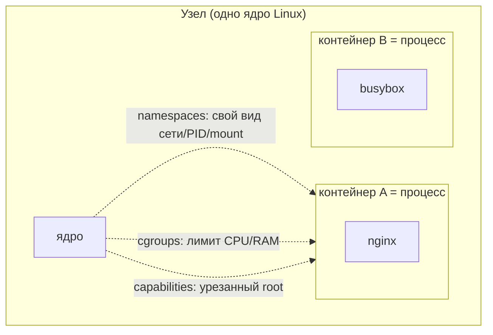
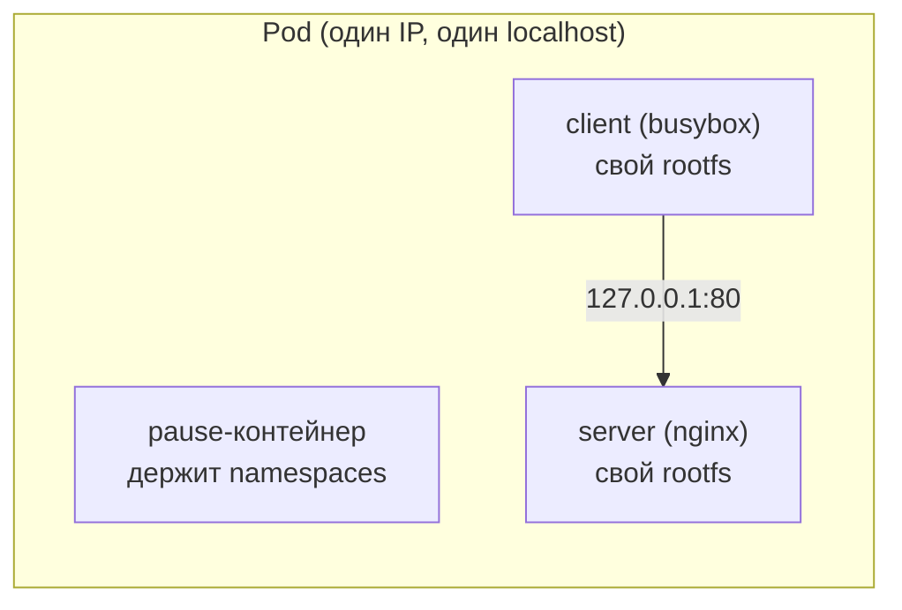

# Контейнер изнутри

> Модуль: `02-workloads` · Тема: `01-containers` · Время: ~25 мин чтения
> Требуется: модуль 01 (основы); знание Docker на уровне «запускал контейнеры»

## Цели урока
После урока вы сможете:
- объяснить, что контейнер — это обычный процесс на узле, изолированный через namespaces и ограниченный через cgroups, а не «лёгкая виртуалка»;
- назвать, что контейнеры одного pod делят (network, IPC, при желании PID), а что у каждого своё (файловая система);
- показать на живом pod, что два контейнера общаются через `localhost` и имеют один IP;
- объяснить роль pause-контейнера, который держит namespaces pod;
- урезать права контейнера через `capabilities` и понимать, зачем это нужно (фундамент для 07-03 и побега из контейнера в 08-02).

## Зачем это нужно
Pod — центральный объект всего модуля, и чтобы не заучивать его поведение, нужно понимать, из чего он собран. А собран он из контейнеров, то есть из трёх примитивов ядра Linux: **namespaces**, **cgroups** и **capabilities**. Эти же три примитива определяют, насколько контейнер изолирован — а значит, насколько он безопасен и что произойдёт при его компрометации.

Для инженера по безопасности это не абстракция: «побег из контейнера» (08-02) — это ровно обход этих трёх механизмов. `privileged`, лишние capabilities, общий с хостом namespace — всё это ослабляет изоляцию. Нельзя защищать то, устройство чего не понимаешь, поэтому начинаем с контейнера изнутри.

## Как это устроено

### Контейнер — это изолированный процесс
Контейнер **не** содержит ядра и не является виртуальной машиной. Это процесс (или дерево процессов), запущенный на ядре узла, которому ядро «показывает» урезанную картину мира:

- **namespaces** (пространства имён ядра — не путать с Kubernetes Namespace!) изолируют то, что процесс *видит*: свои PID, свою сеть, свои точки монтирования, свой hostname. Процесс внутри думает, что он один в системе.
- **cgroups** (control groups) ограничивают то, что процесс *потребляет*: сколько CPU и памяти ему можно. Превысил лимит памяти — ядро убивает процесс (`OOMKilled`, подробно в 06-01).
- **capabilities** дробят всемогущество root на отдельные права (`NET_BIND_SERVICE` — слушать порт <1024, `NET_ADMIN` — менять сеть, `SYS_ADMIN` — почти всё). Контейнеру можно оставить только нужные.



Отсюда «лёгкость» контейнеров: не нужно грузить отдельное ядро, это просто изолированные процессы. И отсюда же их главный риск: ядро **одно на всех**, пробой изоляции даёт доступ к узлу.

### Что pod делит между контейнерами
Pod — это группа контейнеров, которым Kubernetes отдаёт **часть namespaces общими**:

- **Network namespace — общий.** Все контейнеры pod видят один сетевой интерфейс, один IP и общий `localhost`. Контейнер A достаёт контейнер B по `127.0.0.1:<порт>`. Порт на весь pod один — два контейнера не могут слушать один и тот же порт.
- **IPC namespace — общий.** Контейнеры могут общаться через разделяемую память.
- **PID namespace — по умолчанию раздельный**, но включается общий через `spec.shareProcessNamespace: true` (тогда контейнеры видят процессы друг друга).
- **Файловая система — у каждого своя.** Каждый контейнер поднимается из своего образа со своим rootfs. Общими могут быть только тома (volumes, модуль 05), примонтированные в оба контейнера.



### pause-контейнер
Кто «держит» общие namespaces, пока контейнеры перезапускаются? Скрытый **pause-контейнер** (образ `registry.k8s.io/pause`). kubelet запускает его первым на каждый pod; он ничего не делает, только спит и удерживает network/IPC namespace. Контейнеры приложения присоединяются к его namespaces. Поэтому `nginx` может упасть и перезапуститься, а IP pod не изменится — его держит pause. В `kubectl get pods` pause не виден, но на узле он есть (`crictl ps` внутри узла, см. 01-01).

## Минимальный пример
Pod из двух контейнеров, общающихся по `localhost`:

```yaml
# apply: kubectl apply -f shared.yaml -n lab-02-01
apiVersion: v1
kind: Pod
metadata:
  name: shared
spec:
  containers:
    - name: server
      image: nginx:1.27-alpine
      ports:
        - containerPort: 80
    - name: client
      image: busybox:1.36
      command: ["sh", "-c", "sleep 3600"]
```

### Разбор полей
| Поле | Что значит |
|---|---|
| `spec.containers` | Список контейнеров pod. Их больше одного — это multi-container pod |
| `containers[].command` | Переопределяет entrypoint образа. `sleep 3600`, чтобы busybox не завершился сразу |
| `containers[].image` | Каждый контейнер — из своего образа, со своим rootfs |

## Наблюдаем в кластере

**Оба контейнера работают, у pod один IP:**
```bash
kubectl get pod shared -n lab-02-01 -o jsonpath='{.status.podIP}{"\n"}'
kubectl get pod shared -n lab-02-01 -o jsonpath='{range .spec.containers[*]}{.name}{"\n"}{end}'
```

**Общая сеть — client достаёт server по `localhost`:**
```bash
kubectl exec shared -c client -n lab-02-01 -- wget -qO- http://localhost
```
```text
<!DOCTYPE html>
... Welcome to nginx! ...
```
Это работает именно потому, что контейнеры делят network namespace. Будь они в разных pod, `localhost` указывал бы каждый на себя.

**Своя файловая система у каждого:**
```bash
kubectl exec shared -c server -n lab-02-01 -- ls /etc/nginx    # есть
kubectl exec shared -c client -n lab-02-01 -- ls /etc/nginx    # нет такого каталога
```

### Урезаем права: capabilities
По умолчанию контейнер получает набор capabilities «почти как root внутри». Хорошая практика — отобрать всё лишнее. nginx умеет работать и без единой capability (под root привязка к порту 80 не требует `NET_BIND_SERVICE`):

```yaml
apiVersion: v1
kind: Pod
metadata:
  name: dropped
spec:
  containers:
    - name: web
      image: nginx:1.27-alpine
      securityContext:
        capabilities:
          drop: ["ALL"]        # отобрать все capabilities
```
`securityContext` подробно разбирается в уроке 07-03; здесь важно увидеть, что права контейнера — настраиваемы, и «меньше прав» — это и есть харденинг. Проверить, что pod всё равно работает:
```bash
kubectl get pod dropped -n lab-02-01 -o jsonpath='{.status.phase}{"\n"}'
```

## Частые ошибки и диагностика
| Симптом | Причина | Как найти |
|---|---|---|
| Второй контейнер pod в `CrashLoopBackOff` | у него нет долгоживущего процесса (например, busybox без `command`, сразу завершился) | `kubectl logs <pod> -c <container>`; дайте контейнеру процесс (`sleep`, демон) |
| `address already in use` при старте второго контейнера | два контейнера pod слушают один порт — network namespace общий | разнесите порты: в pod порт уникален на весь pod |
| `kubectl exec` без `-c` берёт не тот контейнер | в multi-container pod по умолчанию выбирается первый | всегда указывайте `-c <container>` |
| контейнер не видит файлы соседнего | файловые системы у контейнеров раздельные | общее — только через общий volume (модуль 05) |
| приложению «не хватает прав» после `drop: ALL` | отобрали нужную capability | верните точечно через `capabilities.add` (подробно 07-03) |

## Шпаргалка
```bash
kubectl get pod <p> -o jsonpath='{.status.podIP}'                 # один IP на pod
kubectl get pod <p> -o jsonpath='{range .spec.containers[*]}{.name}{"\n"}{end}'  # контейнеры pod
kubectl exec <p> -c <container> -- <cmd>                          # команда в нужном контейнере
kubectl exec <p> -c client -- wget -qO- http://localhost         # общая сеть pod
kubectl logs <p> -c <container>                                   # логи одного контейнера
docker exec <узел> crictl ps                                      # контейнеры глазами runtime (вкл. pause)
```
`securityContext.capabilities` (drop/add) — урезать права контейнера; подробно в 07-03.

## Вопросы для самопроверки
1. Чем контейнер отличается от виртуальной машины в двух словах?
<details><summary>Ответ</summary>

Контейнер — это процесс на ядре узла, изолированный namespaces и ограниченный cgroups. У него нет своего ядра. VM несёт отдельное ядро и ОС. Поэтому контейнеры легче, но делят одно ядро — пробой изоляции опаснее.
</details>

2. Два контейнера в одном pod. Один слушает `:80`, второй пытается тоже слушать `:80`. Что будет?
<details><summary>Ответ</summary>

Второй не сможет — `address already in use`. Network namespace у pod общий, порт один на весь pod. Контейнеры должны слушать разные порты.
</details>

3. Почему `client` достаёт `server` по `127.0.0.1`, хотя это разные контейнеры?
<details><summary>Ответ</summary>

Контейнеры одного pod делят network namespace: общий сетевой стек, один IP и общий `localhost`. Для них `127.0.0.1` — это весь pod.
</details>

4. Контейнер `nginx` в pod упал и перезапустился. Почему IP pod не изменился?
<details><summary>Ответ</summary>

Network namespace держит pause-контейнер, а не nginx. Контейнеры приложения присоединяются к его namespace. Пока жив pod (и его pause), IP сохраняется.
</details>

5. Приложению из образа нужно записать файл, который кладёт соседний контейнер. Как это сделать?
<details><summary>Ответ</summary>

Файловые системы контейнеров раздельны. Общий доступ — только через том (volume), примонтированный в оба контейнера (модуль 05). Напрямую в rootfs соседа попасть нельзя.
</details>

6. Зачем в проде отбирать у контейнера capabilities через `drop: ["ALL"]`?
<details><summary>Ответ</summary>

Чтобы при компрометации у злоумышленника было меньше прав на узле: меньше capabilities — меньше поверхность атаки и сложнее побег из контейнера. Нужные права возвращают точечно (`add`). Подробно — 07-03 и 08-02.
</details>

## Что дальше
Теперь вы знаете, из чего собран контейнер и что делит pod. В следующем уроке (02-02) разберём сам Pod как объект: жизненный цикл, init- и sidecar-контейнеры, restartPolicy, Downward API и хуки.

Лабораторная работа: [lab/README.md](./lab/README.md).

## Ссылки
- [Pods](https://kubernetes.io/docs/concepts/workloads/pods/)
- [Pods that run multiple containers](https://kubernetes.io/docs/concepts/workloads/pods/#how-pods-manage-multiple-containers)
- [Share Process Namespace between Containers](https://kubernetes.io/docs/tasks/configure-pod-container/share-process-namespace/)
- [Set capabilities for a Container](https://kubernetes.io/docs/tasks/configure-pod-container/security-context/#set-capabilities-for-a-container)
