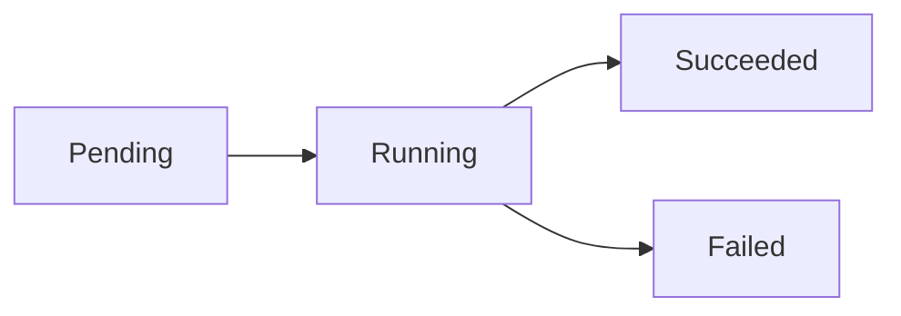
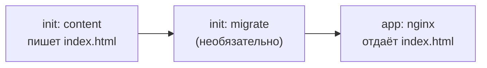

# Pods: жизненный цикл

> Модуль: `02-workloads` · Тема: `02-pods` · Время: ~30 мин чтения
> Требуется: урок 02-01 (контейнер изнутри)

## Цели урока
После урока вы сможете:
- читать фазу pod (`Pending`/`Running`/`Succeeded`/`Failed`) и состояние каждого контейнера (`waiting`/`running`/`terminated`);
- выбирать `restartPolicy` (`Always`/`OnFailure`/`Never`) и объяснять, кто и когда перезапускает контейнер;
- готовить pod к работе через **init-контейнеры**, выполняющиеся по очереди до старта приложения;
- запускать **sidecar** как нативный init-контейнер с `restartPolicy: Always`, живущий рядом с приложением;
- прокидывать в контейнер метаданные pod через **Downward API** и выполнять код на старте/остановке через хуки `postStart`/`preStop`.

## Зачем это нужно
В 02-01 вы увидели, из чего собран pod. Теперь — как он живёт: от создания до завершения. Понимание жизненного цикла отвечает на вопросы, которые возникают каждый день: почему pod застрял в `Pending`, почему контейнер бесконечно перезапускается, как сделать подготовку (миграцию БД, загрузку конфига) до старта приложения и как корректно погасить приложение при удалении.

Это фундамент под три следующих урока: probes (02-03) читают те же состояния контейнеров, Deployment (02-04) создаёт pod по шаблону, а graceful shutdown держится на `preStop` и жизненном цикле.

## Как это устроено

### Фазы pod и состояния контейнеров
У pod есть **фаза** (`status.phase`) — грубая стадия жизни:



- **Pending** — объект принят, но хотя бы один контейнер ещё не запущен (идёт планирование, скачивание образа, выполнение init-контейнеров).
- **Running** — pod назначен на узел, все контейнеры созданы, хотя бы один работает.
- **Succeeded** — все контейнеры завершились с кодом 0 и не будут перезапускаться.
- **Failed** — все контейнеры завершились, и хотя бы один — с ошибкой.

Фаза — это агрегат. Детали — в **состоянии каждого контейнера** (`status.containerStatuses[].state`): `waiting` (с причиной — `ContainerCreating`, `ImagePullBackOff`, `CrashLoopBackOff`), `running` (с временем старта), `terminated` (с кодом выхода и причиной). При отладке смотрят именно сюда, а не только на фазу.

### restartPolicy — кто перезапускает контейнер
`spec.restartPolicy` задаёт, что делать с **завершившимся** контейнером (перезапускает его kubelet на узле):

| Значение | Поведение | Для чего |
|---|---|---|
| `Always` (по умолчанию) | перезапускать всегда, даже после успешного выхода | долгоживущие сервисы (nginx, api) |
| `OnFailure` | перезапускать только при ненулевом коде | задачи, которые должны завершиться (Job, 02-06) |
| `Never` | не перезапускать | одноразовый прогон, где перезапуск не нужен |

Политика действует на все контейнеры pod. Важно: при падении контейнера **pod не пересоздаётся** — kubelet перезапускает контейнер внутри того же pod (растёт счётчик `RESTARTS`). Пересоздание самого pod — это уже работа контроллера (Deployment, 02-04).

### Init-контейнеры — подготовка по очереди
`spec.initContainers` выполняются **до** основных контейнеров, строго по порядку, и каждый должен успешно завершиться, прежде чем начнётся следующий. Только когда отработали все init-контейнеры, стартуют `containers`.

Классический приём: init-контейнер готовит данные в общем томе (`emptyDir`), а приложение их использует.



Пока init-контейнер не отработал, pod висит в `Pending` со статусом `Init:0/1`. Если init падает — pod не идёт дальше (при `restartPolicy: Always` init повторяется, статус `Init:CrashLoopBackOff`).

### Sidecar как нативный init-контейнер
Обычный init-контейнер должен **завершиться**. Но «коляска» (sidecar) — сборщик логов, прокси — должна **жить рядом** с приложением всё время. Для этого init-контейнеру задают `restartPolicy: Always` — он становится **нативным sidecar**: стартует до основных контейнеров, но не завершается, а продолжает работать параллельно приложению (и корректно гасится после него). Это штатный механизм актуальных версий Kubernetes, заменивший ручные трюки с обычными контейнерами.

```yaml
initContainers:
  - name: logshipper
    image: busybox:1.36
    restartPolicy: Always        # <-- превращает init-контейнер в sidecar
    command: ["sh", "-c", "while true; do echo shipping; sleep 10; done"]
```

### Downward API — метаданные pod внутрь контейнера
Контейнеру часто нужно знать про себя: имя pod, узел, namespace, свой IP, запрошенные ресурсы. **Downward API** прокидывает эти поля из объекта pod в контейнер — как переменные окружения или файлы в томе, без обращения к API-серверу:

```yaml
env:
  - name: MY_NODE
    valueFrom:
      fieldRef:
        fieldPath: spec.nodeName
  - name: MY_POD
    valueFrom:
      fieldRef:
        fieldPath: metadata.name
```

### Хуки жизненного цикла: postStart и preStop
`lifecycle.postStart` выполняется сразу после старта контейнера, `lifecycle.preStop` — перед его остановкой (при удалении pod или обновлении). `preStop` — ключ к корректному завершению (graceful shutdown, 02-03): в нём приложение успевает закрыть соединения до того, как придёт `SIGTERM` и истечёт `terminationGracePeriodSeconds`.

```yaml
lifecycle:
  preStop:
    exec:
      command: ["sh", "-c", "nginx -s quit"]
```

## Минимальный пример
Pod, где init-контейнер готовит страницу, а nginx её отдаёт:

```yaml
# apply: kubectl apply -f web.yaml -n lab-02-02
apiVersion: v1
kind: Pod
metadata:
  name: web
spec:
  initContainers:
    - name: content
      image: busybox:1.36
      command: ["sh", "-c", "echo '<h1>from init</h1>' > /html/index.html"]
      volumeMounts:
        - name: html
          mountPath: /html
  containers:
    - name: nginx
      image: nginx:1.27-alpine
      ports:
        - containerPort: 80
      volumeMounts:
        - name: html
          mountPath: /usr/share/nginx/html
  volumes:
    - name: html
      emptyDir: {}
```

### Разбор полей
| Поле | Что значит | По умолчанию |
|---|---|---|
| `spec.initContainers` | Контейнеры, выполняемые по очереди до `containers` | нет |
| `spec.restartPolicy` | Политика перезапуска контейнеров | `Always` |
| `initContainers[].restartPolicy: Always` | Делает init-контейнер нативным sidecar | — |
| `spec.volumes` + `volumeMounts` | Общий том между init и приложением (здесь `emptyDir`, модуль 05) | нет |
| `lifecycle.preStop` | Команда перед остановкой контейнера | нет |

## Наблюдаем в кластере
**Фаза и состояния контейнеров:**
```bash
kubectl get pod web -n lab-02-02
kubectl get pod web -n lab-02-02 -o jsonpath='{.status.phase}{"\n"}'
kubectl get pod web -n lab-02-02 -o jsonpath='{range .status.containerStatuses[*]}{.name}: {.state}{"\n"}{end}'
```
**Что сделал init-контейнер** — приложение отдаёт его результат:
```bash
ip=$(kubectl get pod web -n lab-02-02 -o jsonpath='{.status.podIP}')
kubectl run probe --rm -it --restart=Never --image=busybox:1.36 -n lab-02-02 -- wget -qO- "http://$ip"
# <h1>from init</h1>
```
**События и перезапуски:**
```bash
kubectl describe pod web -n lab-02-02 | sed -n '/Init Containers/,/Conditions/p'
kubectl get pod web -n lab-02-02 -o jsonpath='{.status.containerStatuses[0].restartCount}{"\n"}'
```

## Частые ошибки и диагностика
| Симптом | Причина | Как найти |
|---|---|---|
| pod застрял в `Init:0/1` | init-контейнер не завершился (ждёт, зациклился) | `kubectl logs <pod> -c <init> `; `kubectl describe pod` — раздел Init Containers |
| pod в `Init:CrashLoopBackOff` | init-контейнер падает с ошибкой | `kubectl logs <pod> -c <init> --previous`; почините команду init |
| контейнер в `CrashLoopBackOff`, растёт `RESTARTS` | приложение падает, `restartPolicy: Always` перезапускает | `kubectl logs <pod> --previous` — причина падения |
| pod в `Pending`, контейнеры `waiting: ContainerCreating` долго | тянется образ или не смонтировался том | `kubectl describe pod` — events (Pulling/FailedMount) |
| задача-однократка перезапускается, хотя должна завершиться | `restartPolicy: Always` вместо `OnFailure`/`Never` | для разовых задач — Job (02-06) с нужной политикой |
| приложение не успевает закрыть соединения при удалении | нет `preStop` / мал `terminationGracePeriodSeconds` | добавьте `preStop`, подробно в 02-03 |

## Шпаргалка
```bash
kubectl get pod <p> -o wide                                  # фаза, рестарты, узел
kubectl get pod <p> -o jsonpath='{.status.phase}'            # фаза
kubectl get pod <p> -o jsonpath='{range .status.containerStatuses[*]}{.name}={.ready}{"\n"}{end}'  # готовность контейнеров
kubectl logs <p> -c <container> [--previous]                 # логи (и упавшей прошлой попытки)
kubectl describe pod <p>                                     # events, init-контейнеры, рестарты
kubectl get pod <p> -o jsonpath='{.status.initContainerStatuses[*].name}'  # init-контейнеры
```

## Вопросы для самопроверки
1. Чем фаза `Failed` отличается от контейнера в `CrashLoopBackOff`?
<details><summary>Ответ</summary>

`Failed` — терминальная фаза pod: все контейнеры завершились, и перезапуска не будет (обычно при `restartPolicy: Never`/`OnFailure`). `CrashLoopBackOff` — состояние `waiting` контейнера: он падает, и kubelet снова его перезапускает с нарастающей задержкой (при `restartPolicy: Always` pod при этом `Running`).
</details>

2. У pod `restartPolicy: Always`, контейнер успешно завершился (код 0). Что произойдёт?
<details><summary>Ответ</summary>

kubelet перезапустит его — `Always` перезапускает независимо от кода выхода. Для «отработал и завершился» нужна политика `OnFailure` или `Never` (и обычно Job, 02-06).
</details>

3. Приложению нужно, чтобы перед его стартом выполнилась миграция БД. Как это сделать в рамках pod?
<details><summary>Ответ</summary>

Init-контейнером: он выполнится до основного контейнера и должен успешно завершиться. Пока он не отработал, приложение не стартует (pod в `Init:...`).
</details>

4. Чем sidecar как нативный init-контейнер отличается от обычного init-контейнера?
<details><summary>Ответ</summary>

Обычный init-контейнер должен завершиться, прежде чем пойдут дальше. Нативный sidecar — это init-контейнер с `restartPolicy: Always`: он стартует до основных, но не завершается, а живёт рядом с приложением (сборщик логов, прокси) и гасится после него.
</details>

5. Как контейнеру узнать имя узла, на котором он работает, не обращаясь к API-серверу?
<details><summary>Ответ</summary>

Через Downward API: `env` с `valueFrom.fieldRef.fieldPath: spec.nodeName`. Так же прокидываются `metadata.name`, `metadata.namespace`, `status.podIP` и запрошенные ресурсы — как переменные или файлы тома.
</details>

6. Зачем нужен `preStop` и как он связан с корректным завершением?
<details><summary>Ответ</summary>

`preStop` выполняется перед остановкой контейнера, до/вместе с `SIGTERM`. В нём приложение успевает закрыть соединения и дорегистрироваться, пока не истёк `terminationGracePeriodSeconds`. Без него pod могут убить в середине запроса. Подробно — 02-03.
</details>

## Что дальше
Вы умеете читать состояние pod и управлять его жизненным циклом. В следующем уроке (02-03) — probes: как кластер узнаёт, что контейнер жив и готов принимать трафик, и как корректно его гасить.

Лабораторная работа: [lab/README.md](./lab/README.md).

## Ссылки
- [Pod Lifecycle](https://kubernetes.io/docs/concepts/workloads/pods/pod-lifecycle/)
- [Init Containers](https://kubernetes.io/docs/concepts/workloads/pods/init-containers/)
- [Sidecar Containers](https://kubernetes.io/docs/concepts/workloads/pods/sidecar-containers/)
- [Downward API](https://kubernetes.io/docs/concepts/workloads/pods/downward-api/)
- [Container Lifecycle Hooks](https://kubernetes.io/docs/concepts/containers/container-lifecycle-hooks/)
