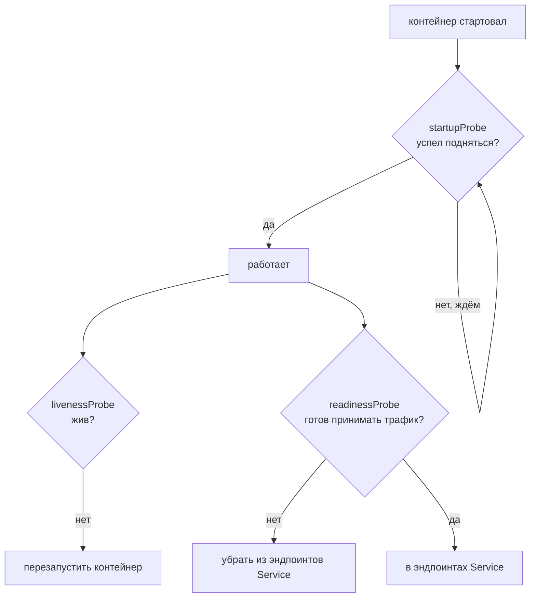
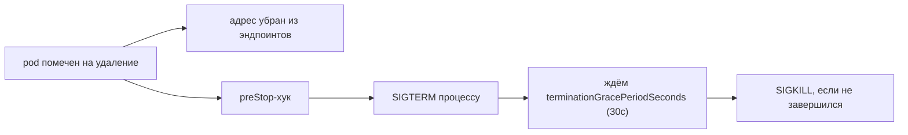

# Probes и graceful shutdown

> Модуль: `02-workloads` · Тема: `03-probes` · Время: ~30 мин чтения
> Требуется: урок 02-02 (жизненный цикл pod)

## Цели урока
После урока вы сможете:
- различать три пробы — `livenessProbe`, `readinessProbe`, `startupProbe` — и объяснять, что делает каждая;
- настроить HTTP-, TCP- и exec-пробу и подобрать её параметры (`periodSeconds`, `failureThreshold`, задержки);
- объяснить, почему неготовый pod исключается из балансировки, и увидеть это на эндпоинтах Service;
- не допускать типовой ошибки «liveness убивает живой контейнер» и понимать, чем это опаснее отсутствия пробы;
- корректно гасить приложение: связка `SIGTERM` → `terminationGracePeriodSeconds` → `preStop`.

## Зачем это нужно
В 02-02 вы видели: kubelet перезапускает упавший контейнер. Но «процесс жив» и «приложение работает» — не одно и то же. Процесс может висеть в дедлоке, не отвечая на запросы; или только что стартовать и ещё не прогреть кэш. Kubernetes не умеет это угадывать — вы должны **сказать** ему, как проверить здоровье, иначе он будет слать трафик в неготовый pod и считать живым зависший.

Пробы — это и есть способ сказать. Они напрямую влияют на доступность: правильная readiness-проба убирает плохой pod из балансировки без простоя, а неправильная liveness-проба способна устроить веерный перезапуск здоровых подов под нагрузкой. Поэтому пробы надо понимать точно, а не копировать наугад.

## Как это устроено

### Три пробы, три разных вопроса


- **livenessProbe** — «контейнер ещё жив?» Если проба проваливается `failureThreshold` раз подряд, kubelet **перезапускает контейнер**. Лечит зависания, которые не приводят к падению процесса.
- **readinessProbe** — «контейнер готов принимать трафик?» Если проваливается — pod помечается `NotReady` и **исключается из эндпоинтов** всех Service. Контейнер при этом **не** перезапускается. Лечит временную неготовность: прогрев, потерю связи с зависимостью.
- **startupProbe** — «приложение уже поднялось?» Пока она не прошла, liveness и readiness **не запускаются**. Нужна медленно стартующим приложениям, чтобы liveness не убила их во время долгого старта.

### Как проверяет: три механизма
У любой пробы один из трёх способов проверки:
- **httpGet** — GET по пути и порту; успех — код 2xx/3xx. Самый частый для веб-приложений.
- **tcpSocket** — TCP-подключение к порту; успех — соединение установилось.
- **exec** — команда внутри контейнера; успех — код выхода 0.

Общие параметры (единые для всех проб):
| Параметр | Что значит | По умолчанию |
|---|---|---|
| `initialDelaySeconds` | пауза перед первой проверкой | 0 |
| `periodSeconds` | как часто проверять | 10 |
| `timeoutSeconds` | сколько ждать ответа | 1 |
| `failureThreshold` | сколько провалов подряд = «не ок» | 3 |
| `successThreshold` | сколько успехов подряд = «ок» (для readiness) | 1 |

### Readiness и эндпоинты Service
readiness-проба — это не «галочка в статусе», а то, что управляет **балансировкой**. Service (подробно в 02-05) держит список эндпоинтов — адресов готовых pod. Пока readiness pod проходит, его адрес в эндпоинтах помечен `ready=true`, и трафик на него идёт. Провалилась readiness — адрес становится `ready=false`, и kube-proxy перестаёт слать на него запросы, **не убивая** сам pod. Как только readiness снова проходит — pod возвращается в балансировку. Это и есть механизм выката и самолечения без простоя.

### Главная ошибка: liveness убивает живой контейнер
Самая опасная проба — liveness, настроенная слишком агрессивно или на не ту проверку. Если liveness ходит на эндпоинт, который зависит от перегруженной БД, то под нагрузкой проба начнёт падать — и kubelet начнёт **перезапускать здоровые контейнеры**, усугубляя проблему. Правила:
- для liveness проверяйте только то, что чинится перезапуском (сам процесс), и ничего внешнего;
- временную неготовность (зависимость недоступна) закрывает **readiness**, а не liveness;
- медленный старт закрывает **startupProbe**, а не большой `initialDelaySeconds` у liveness;
- отсутствие liveness часто безопаснее кривой liveness.

### Корректное завершение (graceful shutdown)
Когда pod удаляют (вручную, при выкате Deployment, при drain узла), происходит так:

Одновременно pod убирают из эндпоинтов (новый трафик не идёт) и запускают `preStop`, затем процессу шлётся `SIGTERM`. У приложения есть `terminationGracePeriodSeconds` (по умолчанию 30), чтобы доработать текущие запросы и завершиться; не успел — прилетает `SIGKILL`. `preStop` (из 02-02) полезен, когда приложение само не ловит `SIGTERM` корректно: например, `nginx -s quit` для аккуратного закрытия.

## Минимальный пример
```yaml
# apply: kubectl apply -f web.yaml -n lab-02-03
apiVersion: v1
kind: Pod
metadata:
  name: web
  labels:
    app: web
spec:
  terminationGracePeriodSeconds: 30
  containers:
    - name: web
      image: nginx:1.27-alpine
      ports:
        - containerPort: 80
      readinessProbe:
        httpGet:
          path: /
          port: 80
        periodSeconds: 5
      livenessProbe:
        httpGet:
          path: /
          port: 80
        periodSeconds: 10
        failureThreshold: 3
      lifecycle:
        preStop:
          exec:
            command: ["sh", "-c", "nginx -s quit"]
```

### Разбор полей
| Поле | Что значит |
|---|---|
| `readinessProbe` | готов ли pod принимать трафик; управляет эндпоинтами Service |
| `livenessProbe` | жив ли контейнер; провал → перезапуск |
| `httpGet.path/port` | что и куда запрашивать; 2xx/3xx = успех |
| `failureThreshold` | сколько подряд провалов до реакции |
| `terminationGracePeriodSeconds` | сколько ждать после `SIGTERM` до `SIGKILL` |
| `lifecycle.preStop` | что выполнить перед остановкой |

## Наблюдаем в кластере

**Готовность pod:**
```bash
kubectl get pod web -n lab-02-03                       # колонка READY 1/1
kubectl get pod web -n lab-02-03 -o jsonpath='{.status.conditions[?(@.type=="Ready")].status}{"\n"}'
```

**Readiness и эндпоинты** — неготовый pod помечен `ready=false`:
```bash
kubectl get endpointslices -n lab-02-03 -l kubernetes.io/service-name=web \
  -o jsonpath='{range .items[*].endpoints[*]}{.addresses[0]} ready={.conditions.ready}{"\n"}{end}'
```

**Провал liveness → перезапуски:**
```bash
kubectl get pod <pod> -n lab-02-03 -o jsonpath='{.status.containerStatuses[0].restartCount}{"\n"}'
kubectl describe pod <pod> -n lab-02-03 | grep -A2 Liveness
```

## Частые ошибки и диагностика
| Симптом | Причина | Как найти |
|---|---|---|
| контейнер циклически перезапускается под нагрузкой | liveness слишком строгая или зависит от внешнего | `kubectl describe pod` → события `Liveness probe failed`; ослабьте/перенесите в readiness |
| pod `Running`, но трафик не идёт, READY `0/1` | readiness не проходит | `kubectl describe pod` → `Readiness probe failed`; проверьте путь/порт пробы |
| медленное приложение убивается сразу после старта | нет `startupProbe`, liveness бьёт слишком рано | добавьте `startupProbe` на время старта |
| проба бьёт не туда (неверный порт/путь) | порт пробы ≠ порт приложения | сверьте `probe.httpGet.port` с `containerPort` и реальным путём |
| запросы рвутся при выкате/удалении | нет graceful: мал `terminationGracePeriodSeconds` или нет `preStop` | добавьте `preStop`, проверьте, что приложение ловит `SIGTERM` |
| exec-проба всегда падает | в образе нет утилиты из команды пробы | возьмите `httpGet`/`tcpSocket` или утилиту, которая есть в образе |

## Шпаргалка
```bash
kubectl get pod <p>                                         # READY n/m
kubectl get pod <p> -o jsonpath='{.status.conditions[?(@.type=="Ready")].status}'  # Ready
kubectl describe pod <p> | grep -E 'Liveness|Readiness|Startup'   # пробы и их провалы
kubectl get pod <p> -o jsonpath='{.status.containerStatuses[0].restartCount}'      # рестарты
kubectl get endpointslices -l kubernetes.io/service-name=<svc> \
  -o jsonpath='{range .items[*].endpoints[*]}{.addresses[0]} {.conditions.ready}{"\n"}{end}'   # готовность эндпоинтов
kubectl delete pod <p> --grace-period=30                    # удаление с грейсом
```

## Вопросы для самопроверки
1. Чем liveness отличается от readiness по последствиям провала?
<details><summary>Ответ</summary>

Провал liveness → kubelet **перезапускает контейнер**. Провал readiness → pod помечается `NotReady` и **убирается из эндпоинтов** Service (трафик не идёт), но контейнер не трогают. Liveness лечит зависания, readiness — временную неготовность.
</details>

2. Приложение стартует 60 секунд. Если поставить только liveness с `periodSeconds: 10, failureThreshold: 3`, что произойдёт?
<details><summary>Ответ</summary>

Liveness начнёт бить сразу, за ~30 секунд наберёт 3 провала и kubelet убьёт ещё стартующий контейнер — бесконечный перезапуск. Нужна `startupProbe` (пока она не прошла, liveness/readiness не работают) либо адекватная задержка старта.
</details>

3. Почему «кривая» liveness опаснее, чем её отсутствие?
<details><summary>Ответ</summary>

Кривая liveness (зависящая от внешнего, слишком строгая) под нагрузкой начинает перезапускать **здоровые** контейнеры, усиливая сбой веерно. Без liveness зависший контейнер хотя бы не плодит перезапуски. Для внешних зависимостей — readiness.
</details>

4. Как Kubernetes перестаёт слать трафик на pod, не убивая его?
<details><summary>Ответ</summary>

Через readiness: при провале адрес pod в эндпоинтах Service помечается `ready=false`, kube-proxy исключает его из балансировки. Pod продолжает работать; как только readiness снова проходит — возвращается в эндпоинты.
</details>

5. Что происходит между «pod помечен на удаление» и `SIGKILL`?
<details><summary>Ответ</summary>

Адрес убирается из эндпоинтов (новый трафик прекращается), выполняется `preStop`, процессу шлётся `SIGTERM`. Даётся `terminationGracePeriodSeconds` (по умолчанию 30) на завершение; если не успел — `SIGKILL`.
</details>

6. readiness-проба ходит на `:8080`, а контейнер слушает `:80`. Что вы увидите?
<details><summary>Ответ</summary>

Readiness всегда проваливается → pod `Running`, но READY `0/1`, и его нет в эндпоинтах, трафик не идёт. В `describe` — `Readiness probe failed: connection refused`. Исправить порт пробы на 80.
</details>

## Что дальше
Pod умеет сообщать о своём здоровье и корректно гаснуть. Но пока это одиночные pod — упал узел, и pod не вернётся. В следующем уроке (02-04) — Deployment: как держать N реплик, обновлять их без простоя (тут и пригодятся readiness + graceful) и откатываться.

Лабораторная работа: [lab/README.md](./lab/README.md).

## Ссылки
- [Configure Liveness, Readiness and Startup Probes](https://kubernetes.io/docs/tasks/configure-pod-container/configure-liveness-readiness-startup-probes/)
- [Pod Lifecycle: Container probes](https://kubernetes.io/docs/concepts/workloads/pods/pod-lifecycle/#container-probes)
- [Pod termination](https://kubernetes.io/docs/concepts/workloads/pods/pod-lifecycle/#pod-termination)
