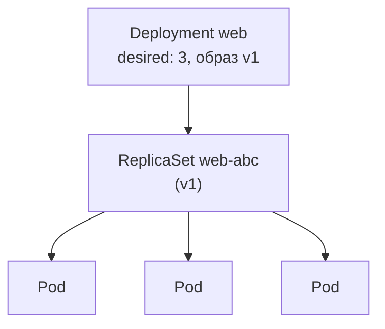
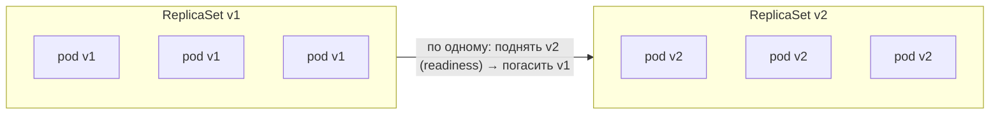

# Deployments и rollout

> Модуль: `02-workloads` · Тема: `04-deployments` · Время: ~30 мин чтения
> Требуется: уроки 02-02 (жизненный цикл pod), 02-03 (probes)

## Цели урока
После урока вы сможете:
- объяснить цепочку Deployment → ReplicaSet → Pod и роль каждого звена;
- создать Deployment, который держит N реплик и сам восстанавливает упавшие;
- выкатывать новую версию через rolling update и управлять ею (`maxSurge`, `maxUnavailable`);
- смотреть статус выката и откатываться на прошлую ревизию (`rollout status`/`history`/`undo`);
- задавать минимальные `requests` в шаблоне pod и понимать, зачем они нужны уже сейчас.

## Зачем это нужно
Одиночный pod (уроки 02-01…02-03) — смертен: упал узел, и pod не вернётся; удалили — не восстановится. В проде вы почти никогда не создаёте pod напрямую. Нужен контроллер, который:
- держит заданное число реплик и возвращает их после сбоя (это вы видели в 01-01 на эксперименте с controller-manager);
- обновляет версию **без простоя**, по одному заменяя pod;
- умеет откатиться, если новая версия сломана.

Это и есть **Deployment** — самый частый объект для stateless-приложений. На нём держатся frontend и api нашего `shop`.

## Как это устроено

### Три уровня: Deployment → ReplicaSet → Pod

- **Pod** — единица запуска.
- **ReplicaSet** — держит **ровно N одинаковых** pod по шаблону (контроллер из 01-01: «нужно 3, есть 2 → создать»). Сам по себе руками почти не создаётся.
- **Deployment** — управляет ReplicaSet'ами и организует **переход** от одной версии к другой. Каждая новая версия шаблона — это новый ReplicaSet.

Вы редактируете Deployment; он создаёт/масштабирует ReplicaSet; тот создаёт/удаляет Pod. Поэтому удалённый pod возвращается (его пересоздаёт ReplicaSet), а «сломанный» выкат можно откатить (Deployment переключится на прошлый ReplicaSet).

### Rolling update — обновление без простоя
При изменении шаблона pod (обычно `image`) Deployment создаёт **новый** ReplicaSet и постепенно переносит реплики: поднимает pod новой версии, ждёт их готовности (по **readiness** из 02-03!), гасит старые. Скоростью управляют:

- **maxSurge** — на сколько можно временно превысить `replicas` (сколько лишних pod поднять). По умолчанию 25%.
- **maxUnavailable** — сколько реплик можно временно недосчитаться. По умолчанию 25%.


Именно здесь работают уроки 02-03: пока новый pod не прошёл readiness, трафик на него не идёт и старый не гасится; при удалении старого отрабатывает graceful shutdown. Поэтому обновление происходит без простоя — если пробы настроены верно.

### Откат (rollback)
Deployment хранит историю ревизий (прошлые ReplicaSet). Если новая версия сломана:
```bash
kubectl rollout status deployment/web      # следить за выкатом
kubectl rollout history deployment/web     # список ревизий
kubectl rollout undo deployment/web        # откатиться на предыдущую
```
Откат — это переключение обратно на прошлый ReplicaSet; быстро и предсказуемо.

### requests — вводим уже сейчас
`resources.requests` — сколько CPU и памяти pod **запрашивает**. Scheduler (01-01) по этим числам выбирает узел, где хватит места. Без `requests` планировщик считает, что pod ничего не просит, и может набить на узел столько, что все начнут голодать. Поэтому хорошая практика — задавать requests **с самого начала**; подробно (вместе с limits, QoS, OOMKilled) — в уроке 06-01, а здесь мы просто кладём минимальные значения в шаблон, как делают в проде.

## Минимальный пример
Deployment для frontend нашего `shop` — 3 реплики с readiness и requests:

```yaml
# apply: kubectl apply -f web.yaml -n lab-02-04
apiVersion: apps/v1
kind: Deployment
metadata:
  name: web
  labels:
    app.kubernetes.io/part-of: shop
spec:
  replicas: 3
  selector:
    matchLabels:
      app: web
  template:
    metadata:
      labels:
        app: web
    spec:
      containers:
        - name: web
          image: nginx:1.27-alpine
          ports:
            - containerPort: 80
          readinessProbe:
            httpGet:
              path: /
              port: 80
          resources:
            requests:
              cpu: 10m
              memory: 16Mi
```

### Разбор полей
| Поле | Что значит | По умолчанию |
|---|---|---|
| `spec.replicas` | Сколько pod держать | 1 |
| `spec.selector.matchLabels` | По каким меткам Deployment считает pod «своими». Должен совпадать с `template.metadata.labels` | — (обязательно) |
| `spec.template` | Шаблон pod; его изменение запускает новый rollout | — (обязательно) |
| `spec.strategy.rollingUpdate.maxSurge` / `maxUnavailable` | Темп выката | 25% / 25% |
| `resources.requests` | Запрошенные CPU/память; по ним планирует scheduler | нет |

> **Важно:** `selector.matchLabels` и `template.metadata.labels` должны совпадать, иначе api-server отклонит Deployment (`selector does not match template labels`). Селектор после создания неизменяем.

## Наблюдаем в кластере

**Цепочка объектов:**
```bash
kubectl get deployment,replicaset,pod -n lab-02-04 -l app=web
```
Deployment создаёт ReplicaSet (имя `web-<хэш>`), тот — pod'ы.

**Самовосстановление:** удалите pod — ReplicaSet создаст новый:
```bash
kubectl delete pod -n lab-02-04 -l app=web --field-selector status.phase=Running | head -1
kubectl get pods -n lab-02-04 -l app=web      # снова 3, один моложе
```

**Выкат и откат:**
```bash
kubectl set image deployment/web web=nginx:1.26-alpine -n lab-02-04
kubectl rollout status deployment/web -n lab-02-04
kubectl get rs -n lab-02-04 -l app=web                     # два ReplicaSet: старый (0) и новый (3)
kubectl rollout undo deployment/web -n lab-02-04
kubectl rollout history deployment/web -n lab-02-04
```

## Частые ошибки и диагностика
| Симптом | Причина | Как найти |
|---|---|---|
| `selector does not match template labels` при apply | метки в `selector` и `template` разошлись | сверьте `spec.selector.matchLabels` и `spec.template.metadata.labels` |
| выкат завис, новые pod в `ImagePullBackOff` | неверный образ/тег в новой версии | `kubectl rollout status` зависает; `kubectl get pods` → новый RS в ошибке; `kubectl rollout undo` |
| обновление уронило сервис (кратковременный простой) | нет readiness / `maxUnavailable` слишком большой | добавьте readiness (02-03), уменьшите `maxUnavailable` |
| pod в `Pending`, `FailedScheduling: Insufficient cpu/memory` | `requests` больше, чем свободно на узлах | уменьшите `requests` или освободите узлы (06-01) |
| удалил pod, а он вернулся — «не удаляется» | это нормально: ReplicaSet держит `replicas` | меняйте `replicas` или удаляйте Deployment, а не отдельные pod |
| правлю pod, созданный Deployment, — правка откатывается | Deployment приводит pod к шаблону | правьте шаблон в Deployment, не сам pod |

## Шпаргалка
```bash
kubectl create deployment web --image=nginx:1.27-alpine --replicas=3   # быстрый старт
kubectl get deploy,rs,pod -l app=web                        # вся цепочка
kubectl scale deployment/web --replicas=5                   # изменить число реплик
kubectl set image deployment/web web=nginx:1.26-alpine      # выкатить новый образ
kubectl rollout status deployment/web                       # следить за выкатом
kubectl rollout history deployment/web                      # ревизии
kubectl rollout undo deployment/web [--to-revision=N]       # откат
kubectl explain deployment.spec.strategy.rollingUpdate      # параметры темпа
```

## Вопросы для самопроверки
1. Зачем между Deployment и Pod есть ReplicaSet — почему Deployment не управляет pod напрямую?
<details><summary>Ответ</summary>

ReplicaSet держит N одинаковых pod одной версии. Deployment управляет **переходом между версиями**: каждая версия — свой ReplicaSet. Это и даёт rolling update (параллельно живут старый и новый RS) и откат (переключение на прошлый RS).
</details>

2. Вы удалили один pod Deployment. Что произойдёт и почему?
<details><summary>Ответ</summary>

ReplicaSet увидит «нужно N, есть N-1» и создаст новый pod (reconcile loop, 01-01). Удалить pod «насовсем» можно, только изменив `replicas` или удалив Deployment.
</details>

3. Что именно запускает новый rollout?
<details><summary>Ответ</summary>

Изменение `spec.template` (шаблона pod) — чаще всего `image`, но также env, ресурсы и т.д. Deployment создаёт новый ReplicaSet и постепенно переносит реплики. Изменение одного `replicas` — это масштабирование, не новый rollout.
</details>

4. Как readiness-проба влияет на rolling update?
<details><summary>Ответ</summary>

Deployment ждёт, пока новый pod пройдёт readiness, прежде чем гасить старый и продолжать выкат. Без readiness обновление может «завершиться» раньше, чем приложение реально готово, — и дать простой.
</details>

5. Новая версия выкатилась и сломана. Чем откат быстрый и безопасный?
<details><summary>Ответ</summary>

`kubectl rollout undo` переключает Deployment обратно на прошлый ReplicaSet, который уже описывает рабочую версию. Не нужно пересобирать — просто поднимаются pod прошлой ревизии.
</details>

6. Почему `requests` стоит задавать сразу, хотя подробно ресурсы в 06-01?
<details><summary>Ответ</summary>

По `requests` scheduler выбирает узел и резервирует место. Без них планировщик думает, что pod ничего не просит, и может переполнить узел — все pod начнут голодать. Минимальные requests в шаблоне — базовая гигиена.
</details>

## Что дальше
Приложение теперь живёт в нужном числе реплик и обновляется без простоя. Но реплики раскиданы по узлам и у каждой свой IP — как обратиться к ним по одному стабильному адресу? В следующем уроке (02-05) — Service.

Лабораторная работа: [lab/README.md](./lab/README.md).

## Ссылки
- [Deployments](https://kubernetes.io/docs/concepts/workloads/controllers/deployment/)
- [ReplicaSet](https://kubernetes.io/docs/concepts/workloads/controllers/replicaset/)
- [Rolling updates](https://kubernetes.io/docs/tutorials/kubernetes-basics/update/update-intro/)
- [Resource requests](https://kubernetes.io/docs/concepts/configuration/manage-resources-containers/)
