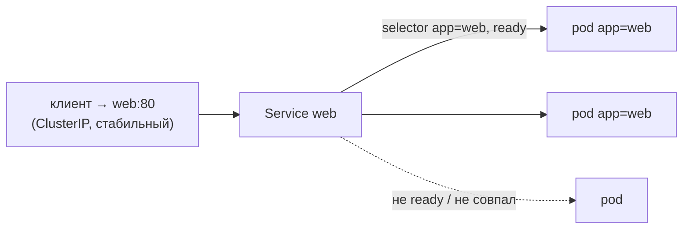
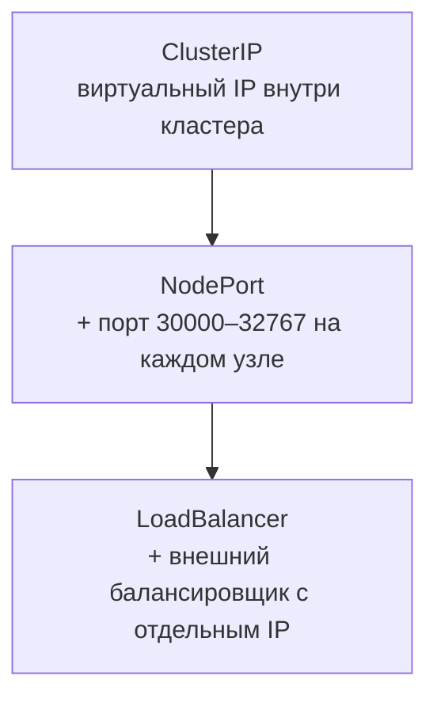
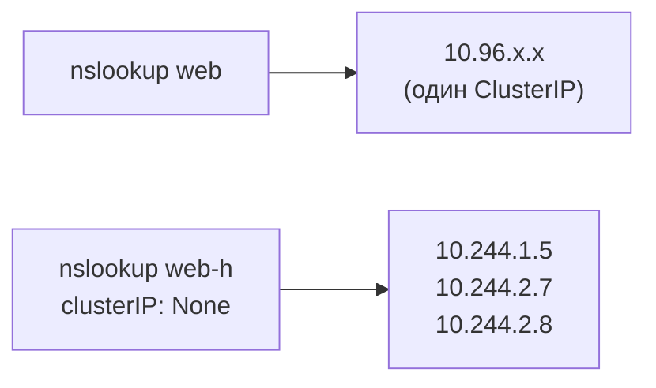

# Services

> Модуль: `02-workloads` · Тема: `05-services` · Время: ~35 мин чтения
> Требуется: уроки 02-04 (Deployment), 01-03 (labels/selectors), 02-03 (readiness/эндпоинты)

## Цели урока
После урока вы сможете:
- объяснить, зачем нужен Service, если у pod уже есть IP, и обращаться к сервису по DNS-имени;
- создавать Service типа `ClusterIP`, `NodePort` и `LoadBalancer` и выбирать тип под задачу;
- различать `port`, `targetPort` и `nodePort`, в том числе именованный `targetPort`;
- читать эндпоинты Service (EndpointSlice) и по ним находить, почему трафик не доходит;
- применять headless-Service (без ClusterIP) и объяснять, чем он отличается от обычного.

## Зачем это нужно
После 02-04 у `shop` есть реплики frontend и api. Но у каждого pod свой IP, и эти IP **эфемерны**: pod пересоздался при выкате или после сбоя — IP другой. Зашить IP pod в конфигурацию frontend нельзя. Нужна стабильная точка входа, которая:
- не меняется, пока существует (один адрес и DNS-имя);
- сама балансирует запросы по готовым репликам;
- автоматически обновляет список бэкендов, когда pod появляются и исчезают.

Это и есть **Service** (сервис). Он превращает набор эфемерных pod в один постоянный адрес. На Service опираются DNS (04-02), Ingress/Gateway (04-03) и связь ярусов `shop` между собой: frontend ходит в `http://api`, api — в `redis:6379`.

## Как это устроено

### Service = стабильный адрес + балансировка по селектору
Service держит **виртуальный IP** (ClusterIP) и `selector`. Все pod, чьи метки совпали с селектором и которые **готовы** (readiness, 02-03), попадают в список эндпоинтов. Трафик на ClusterIP перехватывает kube-proxy (01-01) на каждом узле и раскидывает по этим эндпоинтам. Сам ClusterIP не «висит» ни на одном интерфейсе — это правило в iptables/nftables узла; подробно путь пакета разберём в 04-01.



Ключевая развязка: клиент знает только имя `web`, а какие именно pod за ним — дело Service. Pod пересоздаются, их IP меняются — адрес Service остаётся. Имя `web` резолвит CoreDNS: внутри того же namespace хватает короткого имени, из другого — `web.<namespace>`, полное — `web.<namespace>.svc.cluster.local` (детали в 04-02).

### Endpoints и EndpointSlice
Список готовых адресов за Service — это отдельные объекты, их ведёт контроллер в control plane, следя за pod по селектору и их readiness. Исторически это был один объект `Endpoints`, сейчас — **EndpointSlice** (API `discovery.k8s.io/v1`): большие списки режутся на части по ~100 адресов, и при изменении одного pod не нужно переписывать огромный объект.

```bash
kubectl get endpointslices -l kubernetes.io/service-name=web
```
API `v1 Endpoints` с Kubernetes 1.33 помечен устаревшим: `kubectl get endpoints` ещё работает, но печатает `Warning: v1 Endpoints is deprecated`. Пользуйтесь EndpointSlice; `kubectl describe svc` показывает адреса в любом случае.

Если у Service **нет эндпоинтов** — трафику некуда идти. Две самые частые причины уже знакомы: селектор не совпал с метками pod (01-03) или pod не проходят readiness (02-03).

### port, targetPort, nodePort
У Service до трёх портов, и их постоянно путают:
- **`port`** — порт самого Service, к нему обращается клиент (`web:80`);
- **`targetPort`** — порт контейнера в pod, куда переслать;
- **`nodePort`** — порт на каждом узле, только для `NodePort`/`LoadBalancer`.

```yaml
ports:
  - port: 80          # клиент идёт на web:80
    targetPort: 8080  # а контейнер слушает :8080
```
Если `targetPort` указывает не на тот порт, что слушает контейнер, эндпоинты будут, а соединение отвалится с `connection refused`: Service исправно шлёт пакеты в pod, но там на этом порту никого нет.

`targetPort` может быть **именем** порта контейнера. Так сделано в `shop/base.yaml`:
```yaml
# в pod api
ports: [{containerPort: 8080, name: http}]
# в Service api
ports: [{port: 80, targetPort: http}]
```
Теперь Service не знает номер порта приложения: если api переедет на 9090, правится только pod, а клиенты по-прежнему ходят на `api:80`. Это заодно защищает от рассинхронизации номеров — главной причины `connection refused`.

### Типы Service
Типы вложены друг в друга: каждый следующий добавляет к предыдущему ещё один способ войти.


- **ClusterIP** (по умолчанию) — виртуальный IP, доступный **только внутри** кластера. Так ярусы `shop` общаются между собой.
- **NodePort** — то же, плюс открывает один и тот же порт из диапазона 30000–32767 на **каждом узле**. Снаружи заходят на `<IP любого узла>:<nodePort>`. В нашем kind порт `30080` control-plane проброшен на `localhost:30080` хоста (`extraPortMappings` в `env/kind-config.yaml`). Номер `nodePort` уникален на весь кластер: два Service не могут занять один и тот же.
- **LoadBalancer** — то же, плюс просит внешний балансировщик с отдельным IP. В облаке его создаёт cloud-controller-manager (01-01), и IP публичный. В kind облака нет, поэтому в курсе стоит локальная замена — **cloud-provider-kind**: он видит Service типа `LoadBalancer`, поднимает на хосте контейнер-балансировщик в docker-сети kind и записывает его IP в `status.loadBalancer.ingress`. Этот IP доступен с хоста (Linux). Пока контроллера нет, `EXTERNAL-IP` висит в `<pending>` — так же, как в «голом» кластере без облака.

Ещё есть `type: ExternalName` — Service без pod, просто DNS-псевдоним (CNAME) на внешнее имя, например на управляемую БД. Он пригодится реже, чем первые три.

### headless-Service (без ClusterIP)
Если задать `clusterIP: None`, Service становится **headless**: у него нет виртуального IP и балансировки kube-proxy, а DNS-имя возвращает **A-записи всех готовых pod** напрямую. Клиент сам выбирает, к какому pod идти. Нужно, когда важны отдельные экземпляры: реплики БД, которые должны найти друг друга, или StatefulSet (05-03), где у каждого pod своё стабильное имя.



### Безопасность: что вы открываете
Тип Service — это решение о **поверхности атаки**:
- `ClusterIP` виден любому pod в кластере, из любого namespace. Ограничить, кто может ходить в `redis`, можно только NetworkPolicy (04-04) — сам Service не фильтрует трафик.
- `NodePort` открывает порт на **всех** узлах, включая control-plane, и обходит Ingress с его TLS и авторизацией. В проде его прячут за файрволом узлов.
- `LoadBalancer` в облаке — это публичный IP в интернете. Ровно так «случайно» выставляют наружу Redis, дашборды и kubelet-подобные API. Поле `spec.loadBalancerSourceRanges` ограничивает, с каких адресов пускать.

Правило для `shop`: наружу смотрит только frontend, api и redis остаются `ClusterIP`.

## Минимальный пример
Services `shop` из `shop/base.yaml` (api в той же форме):
```yaml
# apply: kubectl apply -f svc.yaml -n lab-02-05
apiVersion: v1
kind: Service
metadata:
  name: frontend
  labels:
    app.kubernetes.io/part-of: shop
    app.kubernetes.io/component: frontend
spec:
  type: ClusterIP
  selector:
    app.kubernetes.io/part-of: shop
    app.kubernetes.io/component: frontend
  ports:
    - name: http
      port: 80
      targetPort: http
```
Этот Service отправляет трафик с `frontend:80` на порт с именем `http` готовых pod frontend (у nginx это 80).

### Разбор полей
| Поле | Что значит | По умолчанию |
|---|---|---|
| `spec.selector` | по каким меткам выбирать pod-бэкенды | — (без селектора эндпоинты не создаются автоматически) |
| `spec.ports[].port` | порт Service (на ClusterIP) | — (обязательно) |
| `spec.ports[].targetPort` | номер или имя порта контейнера | = `port` |
| `spec.ports[].name` | имя порта Service; обязательно, если портов несколько | — |
| `spec.ports[].nodePort` | порт на узлах (для NodePort/LoadBalancer) | выбирается из 30000–32767 |
| `spec.type` | `ClusterIP` / `NodePort` / `LoadBalancer` / `ExternalName` | `ClusterIP` |
| `spec.clusterIP: None` | сделать headless; задаётся только при создании | выделяется ClusterIP |
| `status.loadBalancer.ingress` | внешний IP, выданный балансировщиком | пусто (`<pending>`) |

## Наблюдаем в кластере
Работаем в namespace лабы; в конце блока всё удалим, чтобы лаба началась с чистого листа.

**Deployment, Service и обращение по имени:**
```bash
kubectl create namespace lab-02-05
kubectl -n lab-02-05 create deployment web --image=nginx:1.27-alpine --replicas=2
kubectl -n lab-02-05 expose deployment web --port=80
kubectl -n lab-02-05 get svc web
# NAME   TYPE        CLUSTER-IP     EXTERNAL-IP   PORT(S)   AGE
# web    ClusterIP   10.96.48.211   <none>        80/TCP    5s
# клиент внутри кластера — отдельный pod, из которого будем делать запросы
kubectl -n lab-02-05 run client --image=busybox:1.36 -- sleep 3600
kubectl -n lab-02-05 wait --for=condition=Ready pod/client
kubectl -n lab-02-05 exec client -- wget -qO- http://web | head -4
# <!DOCTYPE html> ... <title>Welcome to nginx!</title>
kubectl -n lab-02-05 exec client -- nslookup web.lab-02-05.svc.cluster.local
# Name: web.lab-02-05.svc.cluster.local  Address: 10.96.48.211   ← тот самый ClusterIP
```
`kubectl expose` взял селектор из Deployment (`app=web`). Имя `web` резолвится в ClusterIP, запрос уходит в один из pod.

**Эндпоинты:**
```bash
kubectl -n lab-02-05 get endpointslices -l kubernetes.io/service-name=web \
  -o jsonpath='{range .items[*].endpoints[*]}{.addresses[0]} ready={.conditions.ready}{"\n"}{end}'
# 10.244.1.60 ready=true
# 10.244.2.39 ready=true
kubectl -n lab-02-05 scale deployment web --replicas=3     # и снова посмотрите — адресов стало три
```

**NodePort.** Без явного `nodePort` порт выбирается случайно; с хоста достучимся через IP узла в docker-сети kind:
```bash
kubectl -n lab-02-05 expose deployment web --name=web-np --type=NodePort --port=80
kubectl -n lab-02-05 get svc web-np        # PORT(S) 80:31234/TCP — второй номер и есть nodePort
NODE_IP=$(kubectl get node k8s-course-worker -o jsonpath='{.status.addresses[0].address}')
NODE_PORT=$(kubectl -n lab-02-05 get svc web-np -o jsonpath='{.spec.ports[0].nodePort}')
curl -sI "http://$NODE_IP:$NODE_PORT" | head -1     # HTTP/1.1 200 OK
```
Если сразу после создания `curl` вернул пустоту — повторите через пару секунд: kube-proxy ещё не успел прописать правила на узлах.
Порт открыт на **каждом** узле, а не только там, где живут pod: kube-proxy перешлёт запрос дальше.

**LoadBalancer.** Нужен запущенный cloud-provider-kind:
```bash
./env/cloud-provider-kind.sh          # из корня репозитория; повторный запуск безопасен
kubectl -n lab-02-05 expose deployment web --name=web-lb --type=LoadBalancer --port=80
kubectl -n lab-02-05 get svc web-lb -w   # через 10–20 с <pending> сменится на IP, Ctrl+C
# web-lb   LoadBalancer   10.96.119.163   172.18.0.6   80:30727/TCP   20s
curl -sI http://172.18.0.6 | head -1     # подставьте свой EXTERNAL-IP
docker ps --filter name=kindccm          # контейнер-балансировщик, который поднял cloud-provider-kind
```
У `LoadBalancer` тоже есть nodePort (`30727`) — балансировщик шлёт трафик именно на него, это видно по вложенности типов.

**Уборка демо:**
```bash
kubectl delete namespace lab-02-05
```

## Частые ошибки и диагностика
| Симптом | Причина | Как найти |
|---|---|---|
| запрос висит/отказ, эндпоинтов нет | селектор Service не совпал с метками pod | `kubectl get endpointslices -l kubernetes.io/service-name=<svc>` пуст; сравните `kubectl get svc <svc> -o jsonpath='{.spec.selector}'` и `kubectl get pods --show-labels` |
| эндпоинты есть, но `connection refused` | `targetPort` ≠ порт, который слушает контейнер | сравните `targetPort` с `containerPort`; лучше именованный порт |
| эндпоинты есть, но все `ready=false` | pod не проходят readiness | `kubectl get pods` → READY `0/1`; `describe pod` → события пробы (02-03) |
| `wget: bad address 'web'` | опечатка, другой namespace, проблемы CoreDNS | из другого namespace — `web.<ns>`; DNS — урок 04-02 |
| `provided port is already allocated` | этот `nodePort` уже занят другим Service | `kubectl get svc -A \| grep <порт>` |
| NodePort не открывается с хоста | порт не проброшен в kind | с `localhost` доступен только `30080`; остальные — через IP узла |
| LoadBalancer висит в `<pending>` | нет контроллера балансировщиков | `docker ps --filter name=cloud-provider-kind`; запустите `./env/cloud-provider-kind.sh` |

## Шпаргалка
```bash
kubectl expose deployment web --port=80 [--target-port=8080]          # ClusterIP
kubectl expose deployment web --name=web-np --type=NodePort --port=80 # NodePort
kubectl expose deployment web --name=web-lb --type=LoadBalancer --port=80
kubectl expose deployment web --name=web-h --cluster-ip=None --port=80   # headless
kubectl get svc -o wide                                               # тип, CLUSTER-IP, EXTERNAL-IP, селектор
kubectl describe svc <svc>                                            # селектор, порты, Endpoints, события
kubectl get endpointslices -l kubernetes.io/service-name=<svc>        # кто за Service
kubectl run client --image=busybox:1.36 -- sleep 3600                 # pod-клиент для проверок
kubectl exec client -- wget -qO- http://<svc>                         # запрос к Service по имени
kubectl exec client -- nslookup <svc>.<ns>.svc.cluster.local          # во что резолвится имя
```

## Вопросы для самопроверки
1. У pod уже есть IP. Зачем тогда Service?
<details><summary>Ответ</summary>

IP pod эфемерны: при пересоздании (выкат, сбой) они меняются. Service даёт стабильный виртуальный IP и DNS-имя, сам балансирует по готовым репликам и обновляет список бэкендов. Клиент обращается к имени, не зная конкретных pod.
</details>

2. Service создан, pod работают и готовы, но запрос к нему висит, эндпоинтов нет. Причина?
<details><summary>Ответ</summary>

Селектор Service не совпал с метками pod (01-03). Эндпоинты наполняются по селектору; не совпал — список пуст, трафику некуда идти. Сверить `spec.selector` и `kubectl get pods --show-labels`.
</details>

3. Эндпоинты есть, а запрос получает `connection refused`. Что проверить и как защититься от этой ошибки заранее?
<details><summary>Ответ</summary>

`targetPort` не совпадает с портом, который слушает контейнер: Service шлёт пакеты в pod, но там на этом порту никого нет. Защита — именованный порт: `containerPort` с `name: http` в pod и `targetPort: http` в Service, тогда номер задаётся в одном месте.
</details>

4. Чем отличаются NodePort и LoadBalancer и почему в kind `EXTERNAL-IP` может висеть в `<pending>`?
<details><summary>Ответ</summary>

NodePort открывает порт 30000–32767 на каждом узле — внешний доступ без облака. LoadBalancer добавляет к этому внешний балансировщик со своим IP, который создаёт контроллер облака. В kind облака нет, поэтому без cloud-provider-kind контроллера нет и IP не выдаётся — `<pending>`.
</details>

5. Чем headless-Service отличается от обычного ClusterIP?
<details><summary>Ответ</summary>

У headless (`clusterIP: None`) нет виртуального IP и балансировки; DNS-имя возвращает A-записи всех готовых pod напрямую, и клиент выбирает сам. Нужен, когда важны отдельные экземпляры (StatefulSet, 05-03), а не «любой через балансировщик».
</details>

6. Как readiness связана с эндпоинтами Service?
<details><summary>Ответ</summary>

В балансировку попадают только pod, прошедшие readiness. Неготовый pod остаётся в EndpointSlice с `ready=false` и трафик не получает — на этом механизме из 02-03 стоит выкат без простоя.
</details>

7. Почему redis в `shop` должен оставаться `ClusterIP`, а не `NodePort`?
<details><summary>Ответ</summary>

NodePort открыл бы redis на всех узлах, мимо любых проверок; в облаке LoadBalancer — ещё и в интернет. Redis нужен только api, поэтому ему хватает ClusterIP, а доступ внутри кластера дальше сужает NetworkPolicy (04-04).
</details>

## Что дальше
`shop` теперь доступен по стабильным именам внутри кластера, а наружу его можно выставить через NodePort или LoadBalancer. Модуль «Рабочие нагрузки» завершает урок 02-06: DaemonSet (pod на каждом узле) и Job/CronJob (разовые и периодические задачи) — нагрузки, устроенные иначе, чем Deployment.

Лабораторная работа: [lab/README.md](./lab/README.md).

## Ссылки
- [Service](https://kubernetes.io/docs/concepts/services-networking/service/)
- [EndpointSlices](https://kubernetes.io/docs/concepts/services-networking/endpoint-slices/)
- [Headless Services](https://kubernetes.io/docs/concepts/services-networking/service/#headless-services)
- [Connecting Applications with Services](https://kubernetes.io/docs/tutorials/services/connect-applications-service/)
- [kind: LoadBalancer (cloud-provider-kind)](https://kind.sigs.k8s.io/docs/user/loadbalancer/)
