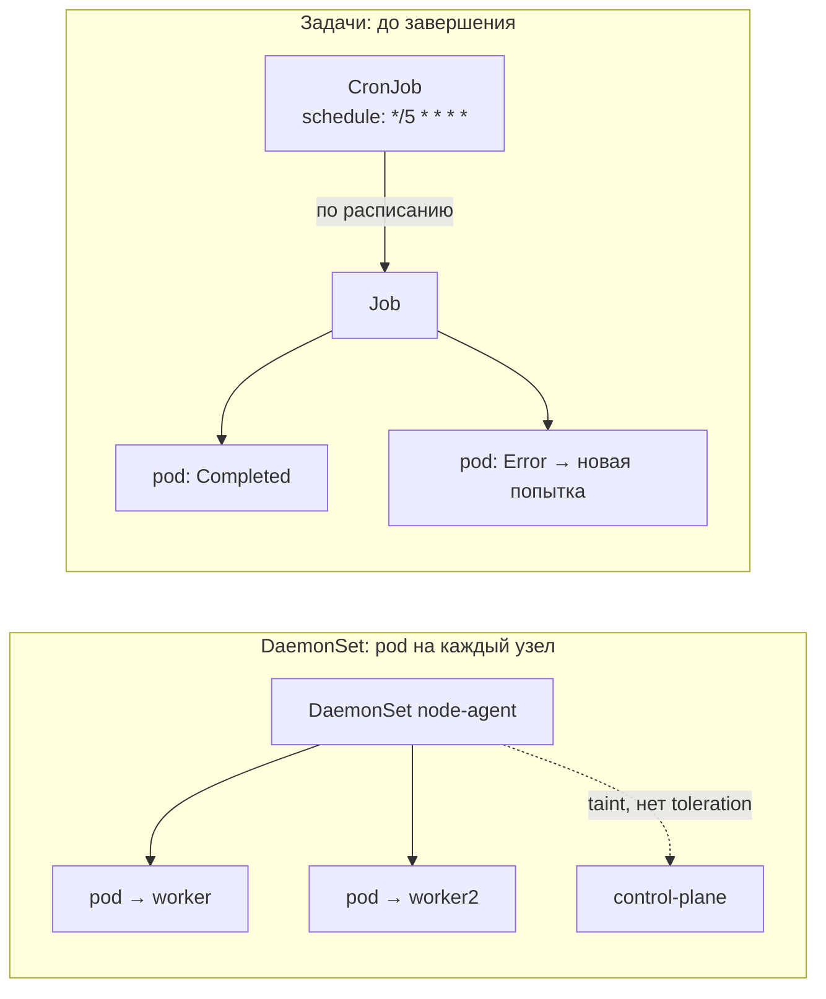

# DaemonSet, Job и CronJob

> Модуль: `02-workloads` · Тема: `06-daemonsets-jobs` · Время: ~35 мин чтения
> Требуется: уроки 02-02 (restartPolicy, Downward API), 02-04 (Deployment, rolling update), 02-05 (Service)

## Цели урока
После урока вы сможете:
- запускать по одному pod на каждом узле через DaemonSet и управлять тем, на каких узлах он работает;
- запускать разовую задачу через Job и настраивать `completions`, `parallelism`, `backoffLimit`, `activeDeadlineSeconds`;
- запускать задачу по расписанию через CronJob с часовым поясом и политикой конкурентности;
- находить, почему DaemonSet не встал на узел, а Job закончился `Failed`.

## Зачем это нужно
Deployment (02-04) решает одну задачу: держать N одинаковых, **бесконечно работающих** и взаимозаменяемых pod где угодно в кластере. Но у `shop` и у самого кластера есть работа, которая в эту модель не влезает:
- **по pod на каждый узел**: сборщик логов узла (09-02), агент мониторинга, runtime-детектор Falco (08-04), сетевой плагин. Им важно не «сколько», а «на каком узле», и при добавлении узла агент должен появиться на нём сам. Deployment с `replicas: 3` этого не гарантирует: два pod спокойно окажутся на одном узле.
- **сделать и завершиться**: миграция схемы БД, прогон smoke-теста после выката, пересчёт отчёта. Deployment с `restartPolicy: Always` будет перезапускать такую задачу вечно (это вы видели в 02-02).
- **делать по расписанию**: ночной бэкап redis, периодическая проверка доступности api, чистка старых данных.

Для этого есть три контроллера: **DaemonSet** (демон-сет), **Job** (задание) и **CronJob** (задание по расписанию).

## Как это устроено



### DaemonSet — pod на каждом узле
DaemonSet не знает поля `replicas`: число pod равно числу подходящих узлов. Контроллер DaemonSet в kube-controller-manager (01-01) следит за списком узлов. Если на узле ещё нет pod — создаёт его, жёстко привязав к узлу через `nodeAffinity`, и дальше pod размещает обычный scheduler. Узел добавили — появился pod, узел удалили — pod уходит вместе с ним.

В кластере уже работают два DaemonSet — без них не было бы сети:
```bash
kubectl -n kube-system get daemonsets
# NAME         DESIRED   CURRENT   READY   ...   NODE SELECTOR
# kindnet      3         3         3             kubernetes.io/os=linux
# kube-proxy   3         3         3             kubernetes.io/os=linux
```

**На каких узлах.** По умолчанию — на всех, куда scheduler разрешит поставить pod. Сузить набор можно `nodeSelector` в шаблоне pod (например, только узлы с меткой `disk=ssd`). Расширить — **tolerations**: на узле control-plane стоит *taint* (метка-запрет) `node-role.kubernetes.io/control-plane:NoSchedule`, и обычные pod туда не попадают. Поэтому ваш DaemonSet в kind по умолчанию встанет только на 2 worker из 3 узлов. Агенту, которому нужен **каждый** узел, добавляют toleration к этому taint, как сделано у `kube-proxy`. Подробно taints и tolerations — в 06-02; здесь достаточно одной строки в шаблоне pod.

**Обновление.** У DaemonSet своя стратегия `updateStrategy`:
- `RollingUpdate` (по умолчанию) — меняет pod по одному узлу за раз, `maxUnavailable: 1`. Можно задать `maxSurge`, чтобы новый pod поднимался на узле раньше, чем гаснет старый;
- `OnDelete` — новый шаблон применяется, только когда вы сами удалите старый pod. Так обновляют критичные агенты вручную, узел за узлом.

Команды `kubectl rollout status/history/undo` работают и для DaemonSet.

### Job — выполнить до успешного завершения
Job создаёт pod и следит, чтобы нужное число из них **успешно завершилось** (код выхода 0). Упал — Job создаст новую попытку; набрал нужное число успехов — Job `Complete`, новых pod не будет.

Главные поля:
- `completions` — сколько успешных завершений нужно (по умолчанию 1);
- `parallelism` — сколько pod работают одновременно (по умолчанию 1). `completions: 6, parallelism: 2` — шесть кусков работы, по два за раз;
- `backoffLimit` — сколько неудачных попыток допустимо (по умолчанию 6). Попытки идут с нарастающей паузой: 10 с, 20 с, 40 с… до 6 минут. Лимит исчерпан — Job `Failed` с причиной `BackoffLimitExceeded`;
- `activeDeadlineSeconds` — общий таймаут Job. Истёк — все pod убиваются, Job `Failed` с причиной `DeadlineExceeded`. Защищает от задачи, которая зависла и не падает;
- `ttlSecondsAfterFinished` — через сколько секунд после завершения удалить Job вместе с pod. Без него завершённые Job копятся в namespace.

`restartPolicy` у pod в Job — только `Never` или `OnFailure`; `Always` API отвергнет. Разница (см. 02-02):
- `OnFailure` — kubelet перезапускает упавший контейнер **в том же pod**. Pod один, но логи прошлых попыток теряются;
- `Never` — каждая попытка — **новый pod**. Упавшие pod остаются в статусе `Error`, и `kubectl logs` покажет, почему каждая из них упала. Для отладки удобнее `Never`.

**Indexed Job.** С `completionMode: Indexed` каждый pod получает номер своего куска в переменной `JOB_COMPLETION_INDEX` (0…completions-1) — так шесть pod делят работу без внешней очереди. Для тонкой настройки есть `podFailurePolicy` (например, «код 42 — не повторять, сразу `Failed`») и `backoffLimitPerIndex`; в этом уроке они не нужны.

### CronJob — Job по расписанию
CronJob раз в период создаёт Job по шаблону `jobTemplate`. Цепочка такая же, как у Deployment: CronJob → Job → Pod, и у каждого уровня свой контроллер.

- `schedule` — расписание в синтаксисе cron: `минута час день месяц день_недели`. `"*/5 * * * *"` — каждые 5 минут, `"0 3 * * *"` — в 03:00;
- `timeZone` — часовой пояс расписания, например `Europe/Moscow`. Без него время считается по часовому поясу kube-controller-manager (в kind это UTC) — частая причина «бэкап запустился на три часа раньше»;
- `concurrencyPolicy` — что делать, если пора запускать новую Job, а прошлая ещё идёт: `Allow` (по умолчанию, запустить параллельно), `Forbid` (пропустить запуск), `Replace` (убить старую, запустить новую). Для бэкапа почти всегда `Forbid`;
- `startingDeadlineSeconds` — сколько можно опоздать с запуском (контроллер был недоступен). Опоздал сильнее — запуск пропускается;
- `successfulJobsHistoryLimit` / `failedJobsHistoryLimit` — сколько завершённых Job хранить (по умолчанию 3 и 1);
- `suspend: true` — приостановить запуски, не удаляя CronJob.

Запустить CronJob вне расписания, например для проверки: `kubectl create job --from=cronjob/<имя> <имя-job>`.

### Безопасность
- DaemonSet — это код, исполняемый **на каждом узле**, часто с `hostPath`, `hostNetwork` и привилегиями (так устроены сетевые плагины и агенты). Право создавать DaemonSet в кластере почти равно root на всех узлах. Именно поэтому в модуле 07 права на `daemonsets` выдают очень узко, а Pod Security запрещает привилегированные pod в обычных namespace.
- CronJob — классический способ **закрепиться** в кластере: атакующий с правом `create cronjobs` ставит майнер или обратную оболочку «каждые 5 минут», и удаление pod ничего не даёт. В MITRE ATT&CK это техника *Scheduled Task/Job: Container Orchestration Job*; ловить её будем через аудит (08-01) и детект в рантайме (08-04).

## Минимальный пример
DaemonSet-агент, который раз в 30 с сообщает, на каком узле он живёт (имя узла — через Downward API из 02-02), и работает на всех узлах, включая control-plane:
```yaml
# apply: kubectl apply -f node-agent.yaml -n lab-02-06
apiVersion: apps/v1
kind: DaemonSet
metadata:
  name: node-agent
spec:
  selector:
    matchLabels:
      app: node-agent
  template:
    metadata:
      labels:
        app: node-agent
    spec:
      tolerations:
        - key: node-role.kubernetes.io/control-plane
          operator: Exists
          effect: NoSchedule
      containers:
        - name: agent
          image: busybox:1.36
          command: ["sh", "-c", "while true; do echo \"$NODE_NAME ok\"; sleep 30; done"]
          env:
            - name: NODE_NAME
              valueFrom:
                fieldRef:
                  fieldPath: spec.nodeName
          resources:
            requests: {cpu: 5m, memory: 8Mi}
```

Job — smoke-тест api из `shop`: один успешный запрос к Service `api`, не больше двух повторов и не дольше минуты:
```yaml
# apply: kubectl apply -f smoke.yaml -n lab-02-06
apiVersion: batch/v1
kind: Job
metadata:
  name: smoke
spec:
  backoffLimit: 2
  activeDeadlineSeconds: 60
  ttlSecondsAfterFinished: 3600
  template:
    spec:
      restartPolicy: Never
      containers:
        - name: smoke
          image: busybox:1.36
          command: ["wget", "-qO-", "-T", "5", "http://api"]
```

CronJob — тот же запрос каждые 5 минут. `jobTemplate.spec` — это ровно `spec` Job:
```yaml
# apply: kubectl apply -f api-check.yaml -n lab-02-06
apiVersion: batch/v1
kind: CronJob
metadata:
  name: api-check
spec:
  schedule: "*/5 * * * *"
  timeZone: Europe/Moscow
  concurrencyPolicy: Forbid
  jobTemplate:
    spec:
      backoffLimit: 1
      template:
        spec:
          restartPolicy: Never
          containers:
            - name: check
              image: busybox:1.36
              command: ["wget", "-qO-", "-T", "5", "http://api"]
```

### Разбор полей
| Поле | Что значит | По умолчанию |
|---|---|---|
| DaemonSet `spec.template.spec.tolerations` | на какие узлы с taint можно встать | нет (узлы с taint пропускаются) |
| DaemonSet `spec.template.spec.nodeSelector` | ограничить набор узлов | все подходящие узлы |
| DaemonSet `spec.updateStrategy.type` | `RollingUpdate` / `OnDelete` | `RollingUpdate`, `maxUnavailable: 1` |
| Job `spec.completions` | сколько успешных pod нужно | 1 |
| Job `spec.parallelism` | сколько pod одновременно | 1 |
| Job `spec.backoffLimit` | сколько неудачных попыток допустимо | 6 |
| Job `spec.activeDeadlineSeconds` | общий таймаут Job | нет |
| Job `spec.ttlSecondsAfterFinished` | удалить Job через N секунд после завершения | нет (хранится вечно) |
| Job `spec.completionMode` | `NonIndexed` / `Indexed` (номер куска в `JOB_COMPLETION_INDEX`) | `NonIndexed` |
| pod в Job `restartPolicy` | `Never` (новый pod на попытку) / `OnFailure` (перезапуск в pod) | — (обязательно задать) |
| CronJob `spec.schedule` | расписание cron | — (обязательно) |
| CronJob `spec.timeZone` | часовой пояс расписания | пояс kube-controller-manager (в kind UTC) |
| CronJob `spec.concurrencyPolicy` | `Allow` / `Forbid` / `Replace` | `Allow` |
| CronJob `spec.successfulJobsHistoryLimit` / `failedJobsHistoryLimit` | сколько Job хранить | 3 / 1 |

## Наблюдаем в кластере
Демо — в namespace лабы, в конце удалим.
```bash
kubectl create namespace lab-02-06
kubectl config set-context --current --namespace=lab-02-06
```

**DaemonSet и taint control-plane.** Примените пример без блока `tolerations`:
```bash
kubectl get ds node-agent
# NAME         DESIRED   CURRENT   READY   UP-TO-DATE   AVAILABLE   NODE SELECTOR   AGE
# node-agent   2         2         2       2            2           <none>          20s
kubectl get pods -l app=node-agent -o wide       # колонка NODE: worker и worker2
kubectl describe node k8s-course-control-plane | grep Taints
# Taints: node-role.kubernetes.io/control-plane:NoSchedule
```
Добавьте `tolerations` и примените снова — запустится rolling update по узлам, `DESIRED` станет 3:
```bash
kubectl rollout status ds/node-agent
kubectl logs -l app=node-agent --prefix       # у каждого pod своё имя узла
```

**Job с параллелизмом.** Шесть кусков по два одновременно, номер куска — из `JOB_COMPLETION_INDEX`:
```bash
kubectl create job batch --image=busybox:1.36 --dry-run=client -o yaml -- \
  sh -c 'echo part $JOB_COMPLETION_INDEX; sleep 2' > batch.yaml
# допишите в spec: completions: 6, parallelism: 2, completionMode: Indexed
kubectl apply -f batch.yaml
kubectl get pods -l job-name=batch -w           # одновременно Running не больше двух, Ctrl+C
kubectl get job batch
# NAME    STATUS     COMPLETIONS   DURATION   AGE
# batch   Complete   6/6           16s        25s
```

**Неудачная Job.** Запрос в несуществующий порт:
```bash
kubectl create job fail --image=busybox:1.36 -- wget -qO- -T 3 http://api:8080
kubectl get pods -l job-name=fail               # pod в Error; с Never каждая попытка — новый pod
kubectl logs job/fail                           # wget: download timed out (или bad address, если api нет)
kubectl describe job fail | tail -5             # Warning BackoffLimitExceeded — после всех попыток
```
С `backoffLimit: 6` по умолчанию все попытки займут несколько минут из-за нарастающей паузы — для экспериментов ставьте его меньше.

**CronJob по требованию и история:**
```bash
kubectl apply -f api-check.yaml
kubectl get cronjob api-check                   # SCHEDULE, TIMEZONE, LAST SCHEDULE
kubectl create job --from=cronjob/api-check api-check-manual
kubectl get jobs                                # Job, созданные CronJob, называются <cronjob>-<время>
```

**Уборка демо:**
```bash
kubectl delete namespace lab-02-06
```

## Частые ошибки и диагностика
| Симптом | Причина | Как найти |
|---|---|---|
| DaemonSet: `DESIRED` меньше числа узлов | на части узлов taint, у pod нет toleration; или не совпал `nodeSelector` | `kubectl describe node <узел> \| grep Taints`; сравните с `tolerations` и `nodeSelector` в шаблоне |
| `restartPolicy: Unsupported value: "Always"` или `Required value: valid values: "OnFailure", "Never"` | у Job/CronJob не указан или указан `Always` | задайте `Never` или `OnFailure` в `template.spec` |
| Job `Failed`, причина `BackoffLimitExceeded` | задача падает каждую попытку | `kubectl logs job/<job>`; с `Never` — `kubectl get pods -l job-name=<job>` и логи каждого pod |
| Job `Failed`, причина `DeadlineExceeded` | задача не уложилась в `activeDeadlineSeconds` | висит на сети/блокировке — смотрите логи; увеличьте таймаут, только если работа честно долгая |
| в namespace сотни завершённых Job и pod | нет `ttlSecondsAfterFinished` / большие history limits | задайте TTL у Job, лимиты истории у CronJob |
| CronJob запускается не в то время | расписание считается в UTC | задайте `spec.timeZone` |
| две копии бэкапа идут одновременно | `concurrencyPolicy: Allow` по умолчанию | `concurrencyPolicy: Forbid` |
| CronJob создан, но Job не появляются | `suspend: true` или расписание ещё не наступило | `kubectl get cj` → `SUSPEND`, `LAST SCHEDULE`; проверка вне расписания — `kubectl create job --from=cronjob/...` |

## Шпаргалка
```bash
kubectl get ds -A                                          # все DaemonSet, DESIRED = число узлов
kubectl rollout status ds/<ds>                             # выкат DaemonSet
kubectl describe node <node> | grep Taints                 # почему DaemonSet не встал на узел
kubectl create job <job> --image=busybox:1.36 -- <команда> # быстрая Job
kubectl get jobs                                           # STATUS, COMPLETIONS, DURATION
kubectl logs job/<job>                                     # логи (одного из pod Job)
kubectl get pods -l job-name=<job>                         # все попытки Job
kubectl wait --for=condition=complete job/<job> --timeout=60s
kubectl get cronjobs                                       # SCHEDULE, TIMEZONE, SUSPEND, LAST SCHEDULE
kubectl create job --from=cronjob/<cj> <job>               # запуск CronJob вручную
kubectl patch cronjob <cj> -p '{"spec":{"suspend":true}}'  # приостановить
```

## Вопросы для самопроверки
1. Чем DaemonSet отличается от Deployment с `replicas`, равным числу узлов?
<details><summary>Ответ</summary>

Deployment не привязывает pod к узлам: два pod могут оказаться на одном узле, а на новом узле агент сам не появится. DaemonSet ставит ровно один pod на каждый подходящий узел и сам следит за списком узлов: добавили узел — появился pod.
</details>

2. В трёхузловом kind DaemonSet показывает `DESIRED 2`. Почему и как это исправить?
<details><summary>Ответ</summary>

На control-plane стоит taint `node-role.kubernetes.io/control-plane:NoSchedule`, а у pod нет toleration — узел пропускается. Если агент нужен на всех узлах, добавьте в шаблон pod toleration к этому taint (как у `kube-proxy`).
</details>

3. Почему у pod в Job нельзя `restartPolicy: Always`, и чем `Never` отличается от `OnFailure`?
<details><summary>Ответ</summary>

Job должен завершиться, а `Always` перезапускал бы успешно отработавший контейнер вечно — API такое отвергает. `OnFailure` перезапускает контейнер внутри того же pod, логи прошлых попыток теряются. `Never` на каждую попытку создаёт новый pod, упавшие остаются в `Error` с логами — удобнее для отладки.
</details>

4. Job завис на сетевом запросе и не падает. Что его остановит?
<details><summary>Ответ</summary>

`backoffLimit` не поможет: он считает только неудачные попытки, а зависшая попытка не завершается. Нужен `activeDeadlineSeconds` — по его истечении Job убивает pod и получает `Failed` с причиной `DeadlineExceeded`. Плюс таймаут в самой команде.
</details>

5. Ночной бэкап по CronJob иногда идёт дольше суток, и запуски накладываются. Что настроить?
<details><summary>Ответ</summary>

`concurrencyPolicy: Forbid` — новый запуск пропускается, пока идёт прошлый. Заодно стоит задать `timeZone`, чтобы «ночь» была вашей, а не по UTC, и `activeDeadlineSeconds` в `jobTemplate`.
</details>

6. Как проверить CronJob, не дожидаясь расписания?
<details><summary>Ответ</summary>

`kubectl create job --from=cronjob/<cj> <имя>` — создаёт Job по `jobTemplate` прямо сейчас. Такая Job помечена аннотацией `cronjob.kubernetes.io/instantiate: manual`, а у плановых есть `batch.kubernetes.io/cronjob-scheduled-timestamp` — так их можно различить.
</details>

7. Почему право `create` на CronJob и DaemonSet — чувствительное с точки зрения безопасности?
<details><summary>Ответ</summary>

DaemonSet исполняет код на каждом узле, и с привилегиями или `hostPath` это почти root на всём кластере. CronJob — способ закрепиться: задача будет запускаться по расписанию, даже если её pod удаляют. Поэтому эти права выдают узко (07) и отслеживают создание таких объектов в аудите (08-01).
</details>

## Что дальше
Модуль «Рабочие нагрузки» пройден: вы умеете запускать pod, держать реплики, обновлять их без простоя, давать им стабильный адрес и запускать задачи на каждом узле, разово и по расписанию. Дальше — модуль 03: как передать приложению конфигурацию (ConfigMap) и секреты (Secret), не зашивая их в образ.

Лабораторная работа: [lab/README.md](./lab/README.md).

## Ссылки
- [DaemonSet](https://kubernetes.io/docs/concepts/workloads/controllers/daemonset/)
- [Jobs](https://kubernetes.io/docs/concepts/workloads/controllers/job/)
- [CronJob](https://kubernetes.io/docs/concepts/workloads/controllers/cron-jobs/)
- [Automatic cleanup for finished Jobs (TTL)](https://kubernetes.io/docs/concepts/workloads/controllers/ttlafterfinished/)
- [Taints and Tolerations](https://kubernetes.io/docs/concepts/scheduling-eviction/taint-and-toleration/)
- [MITRE ATT&CK: Container Orchestration Job (T1053.007)](https://attack.mitre.org/techniques/T1053/007/)
