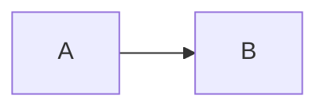

# {{TITLE}}

> Модуль: `{{MODULE}}` · Тема: `{{TOPIC}}` · Время: ~{{N}} мин чтения
> Требуется: <!-- предыдущие уроки, на которые опирается этот -->

## Цели урока
После урока вы сможете:
- …
- …
- …

## Зачем это нужно
<!-- Какую проблему решает объект/механизм. Что будет без него. -->

## Как это устроено
<!-- Модель работы. Mermaid-диаграмма, если помогает. -->



## Минимальный пример
```yaml
# apply: kubectl apply -f example.yaml -n lab-{{NS}}
```

### Разбор полей
| Поле | Что значит | По умолчанию |
|---|---|---|
| `spec.…` | … | … |

## Наблюдаем в кластере
```bash
kubectl get …
```
Ожидаемый вывод:
```text
…
```

## Частые ошибки и диагностика
| Симптом | Причина | Как найти |
|---|---|---|
| … | … | `kubectl describe …` |

## Шпаргалка
```bash
# …
```

## Вопросы для самопроверки
1. …
<details><summary>Ответ</summary>

…
</details>

## Что дальше
<!-- Связь со следующей темой. Ссылка на лабораторную: ./lab/README.md -->

## Ссылки
- Документация Kubernetes: …
